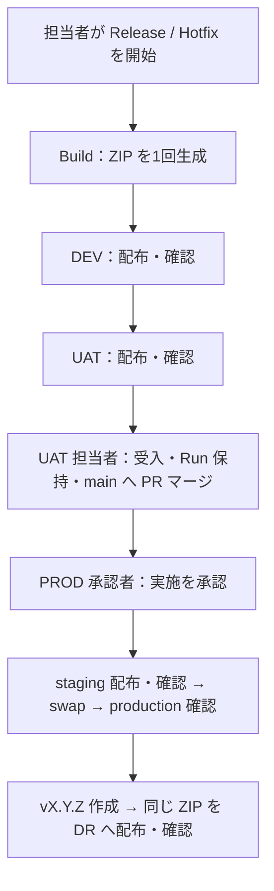

# cicd-demo

**Azure Repos Git + Azure Pipelines で、1回作った ZIP を DEV → UAT → PROD → DR へ配布する PoC です。**
GitHub は設計・実装用のミラーです。実環境の接続先と権限設定は未投入です。

## 最初に覚えること

| Pipeline | 起動条件 | 行うこと |
| --- | --- | --- |
| [CI](pipelines/ci.yml) | PR の Branch Policy と develop/main/release/hotfix の更新 | テスト・Build・パッケージ化の検証。配布権限なし |
| [Release](pipelines/release.yml) | 担当者が release/X.Y.Z または hotfix/X.Y.Z を選んで手動起動 | Build once → DEV → UAT → main 反映確認 → PROD 承認 → staging/swap → Tag → DR |

Agent は2種類です。Build は使い捨ての Microsoft-hosted Ubuntu、Deploy は Private Endpoint に届く専用 Linux Agent を使用します。Build と Deploy を同じ VM に置きません。

**develop の更新は CI だけを実行します。DEV は Release 候補の確認環境です。** 日々の develop 自動配布は採用せず、候補を上書きする経路をなくしました。

## Release の流れ



Stage は **Build / DEV / UAT / Promote の4つ**です。Promote の中に PROD・Tag・DR を並べ、完了まで本番の排他ロックを維持します。UAT のロックも人間の確認が終わるまで維持します。

人間の判断は2か所です。

1. **UAT 担当者**：この Run の受入結果を確認し、Run を `Retain indefinitely` に設定します。候補を main へ PR マージしてから ManualValidation を再開します。
2. **PROD 承認者**：UAT・main・戻し先・実施時間を確認し、`sc-cicd-prod` の Approval を承認します。

本番投入直前に、main の内容と UAT 候補の一致、既存 Tag より新しい版であること、現在の PROD の履歴を含むことを確認します。古い候補を進めるための強制オプションはありません。

## ファイルの読み方

| パス | 内容 |
| --- | --- |
| `app/` | 確認用 Next.js アプリ。`/api/health` が環境・版・SHA・Run ID を返す |
| `pipelines/ci.yml` | CI の全体 |
| `pipelines/release.yml` | Release の全体と環境ごとの設定値 |
| `pipelines/templates/build.yml` | CI/Release 共通の Node Build 手順 |
| `pipelines/templates/deploy.yml` | Web App への配布と Smoke Test |
| `pipelines/scripts/` | Build、Artifact 検証、Smoke、投入前確認・Tag の小さな処理 |
| `tests/test_release.py` | 誤配布・古い候補・二重投入を防ぐ回帰テスト |
| [infra/](infra/README.md) | 最小コストPoC用Bicep。F1共有Plan + DEV/UAT/PROD/DR |
| [docs/setup.md](docs/setup.md) | Azure DevOps / Azure の必須設定と PoC チェックリスト |
| [docs/operations.md](docs/operations.md) | 開発・Release・Hotfix・再実行・Rollback の手順 |
| [docs/design.md](docs/design.md) | 採用理由、削除した仕組み、.NET Functions への展開 |

`release.yml` から読む YAML テンプレートは1階層です。Stage 用テンプレート、共通ルート、Recovery Pipeline はありません。

## Artifact と失敗時の基本

Artifact 名は `release`、中身は `webapp.zip` と `release.json` だけです。後者には版・SHA・Run ID・ZIP の SHA-256 を記録します。全環境で **同じ Run の同じ ZIP** を使い、配布先では再 Build しません。Tag は元の候補 SHA を指し、注釈に Run ID と ZIP の SHA-256 を残します。

| 停止箇所 | 基本対応 |
| --- | --- |
| Build / DEV / UAT | 原因を修正。同じ Artifact なら配布 Stage を再実行、コードを変えたら新しい Run |
| PROD の swap 前 | 本番は通常未変更。状態を確認し、[Runbook](docs/operations.md) で判断 |
| swap 実行中・実行後 | **Promote を再実行しない。** 本番の実状態を確認して復旧 |
| Tag / DR | 本番の成功と Pipeline 全体の成功を区別。再配布せず必要な処理だけ復旧 |

PROD と DR の切替は原子的ではありません。障害時の操作は承認された担当者が行い、Tag や main を自動で巻き戻しません。

## ローカル確認

Node.js 22、Python 3.11 以上を使用します。

```bash
npm ci
python3 -m unittest discover -s tests -v
npm run build
npm run dev
```

Azure PoC を始める前に [setup.md](docs/setup.md) の全項目を確認してください。YAML の条件式だけでは権限境界を構成できません。


## 最小コスト Azure PoC

最初のAzure PoCは、[infra/README.md](infra/README.md) のBicepで **F1のLinux App Service Planを1つだけ作り、DEV / UAT / PROD / DRの4 Web Appで共有**します。Deployment Slot、Private Endpoint、Private DNS、self-hosted Agentはこの段階では作りません。

このPhase 1ではMicrosoft-hosted Agent + public endpointでCI/CDフローを確認し、Slot / Private Endpoint / self-hosted経路はPhase 2で必要な期間だけ追加して検証します。
