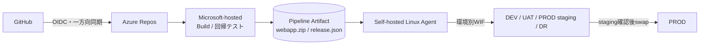
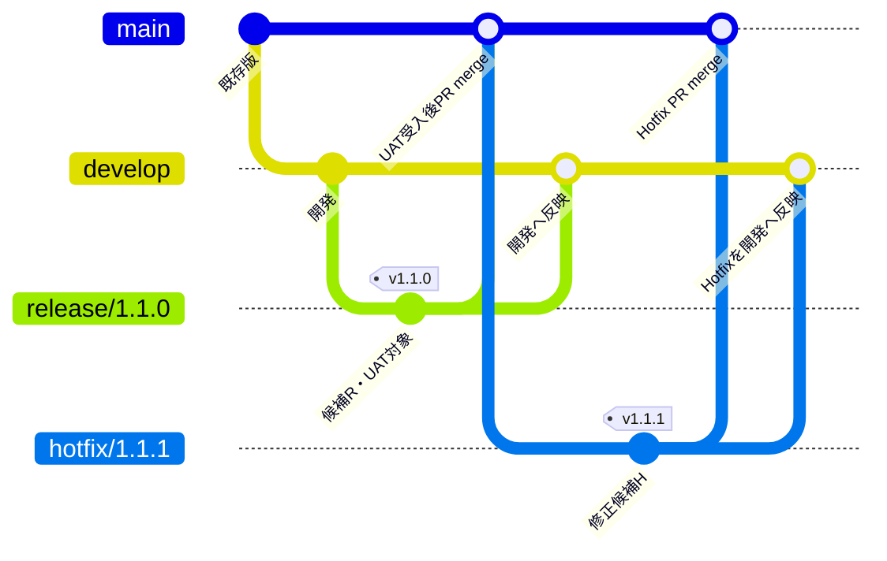
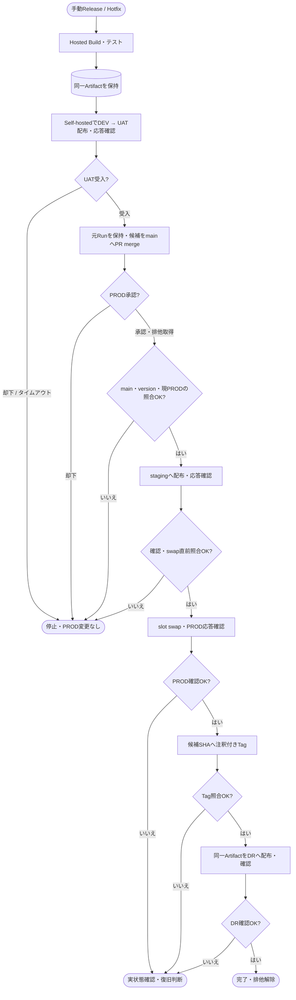
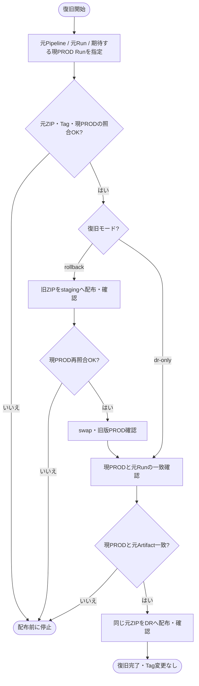

# CI/CD方式設計

## 1. 構成と責務

GitHubをソース管理の正本、Azure Reposを実行ミラーとする。CIとReleaseのBuildをMicrosoft-hostedで行い、Infra・配布・swap・Tag・復旧を専用Self-hosted Linux Agentで実行する。配布AgentでアプリのBuildやnpm installを行わない。

S1 Linux Planを4 Web AppsとPROD stagingで共有し、Public endpointを使用する。`APP_ENV`はslot固定の設定としてswapで移動させない。リソースは専用RG内に保持する。接続・Pool・Environmentの権限とChecksはYAML外の設定も必要であり、[設定](setup.md)にまとめる。

| 要素 | 方針 |
|---|---|
| Artifact | Release Runごとに1回生成。version・候補SHA・Run ID・ZIP SHA-256を記録し、各配布前に照合 |
| 承認 | UATは配布したRunの受入。PRODはService Connection Approval。却下・タイムアウトでは後続を書き換えない |
| 排他 | UAT受入中の上書きを防止。PROD接続のExclusive lockをstaging → swap → Tag → DRまで保持。`lockBehavior: sequential` |
| Tag | PROD応答確認後、Azure Reposに`vX.Y.Z`を作成。対象は候補SHA、注釈は`pipelineRun=<元Run>; sha256=<ZIP digest>` |
| 復旧 | 保持済み元RunのZIP・Tag・現在PRODを照合し、必要な配布だけ実行。Tagを変更しない |

## 2. Gitフロー

`develop`から`release/X.Y.Z`、現在の`main`から`hotfix/X.Y.Z`を作る。Release / Hotfixは同じPipelineを使用する。バージョンは安定版SemVerで、既存Tagと現在PRODより大きくする。

図のTagは**PROD確認後に候補コミットへ付与する参照**を表す。図中の左右位置はTag作成の時刻を表さない。mainのmerge commitをTag対象にはしない。

UAT受入後、PROD承認前に候補をmainへ**merge commit方式**で反映する。Squash / Rebase mergeでは候補SHAの祖先関係を保てない。PROD配布直前とswap直前に、候補SHAがmainの祖先であり、候補と最新mainのファイルツリーが一致することを再確認する。

Hotfixが割り込む場合は旧候補Runを中止する。修正をmain / develop / 継続候補へ反映し、新しいRunでUATをやり直す。同じversionの別Buildを承認済みArtifactとして扱わない。

## 3. 配布と復旧の制御

フロー図では角丸を開始・終了、長方形を処理、ひし形を判断、円筒を保持Artifactとして使用する。

PROD以降の処理は一つのPromote Stageにまとめる。Stage再実行による二重swapをガードで拒否する。Agentが1台でも、手動承認待ち中はAgentを占有しないため、Agentの順番待ちだけを排他手段にはしない。

Rollbackの実機成功は未確認。DR-onlyは実機成功済み。処理中のAgent停止、複数人承認、一般開発者の権限拒否など、本番利用前の課題は[検証結果](selfhosted-validation.md)へ分離する。
