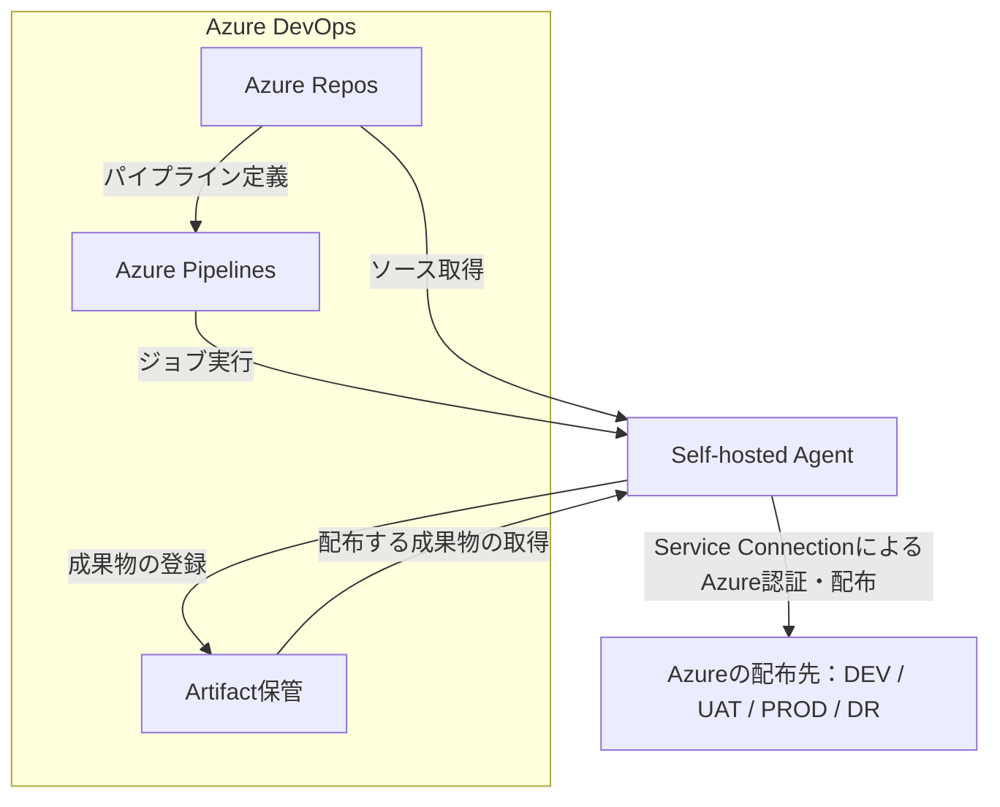
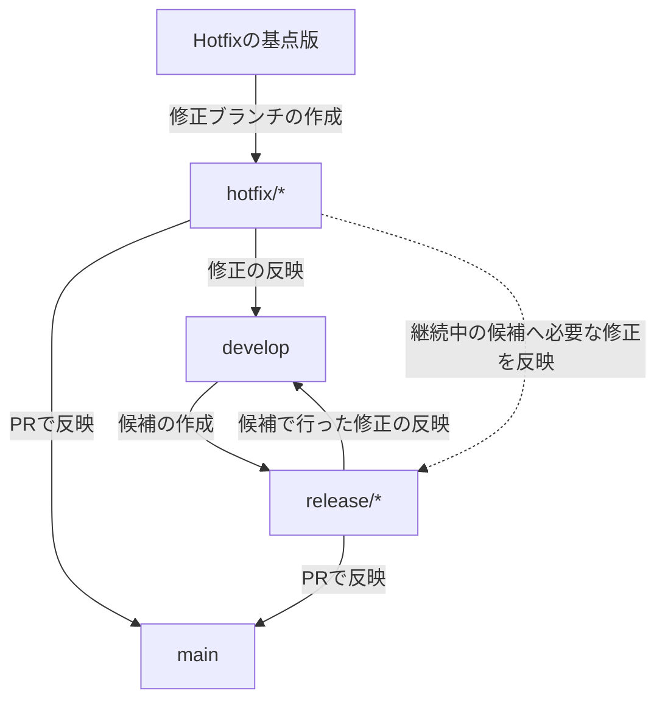
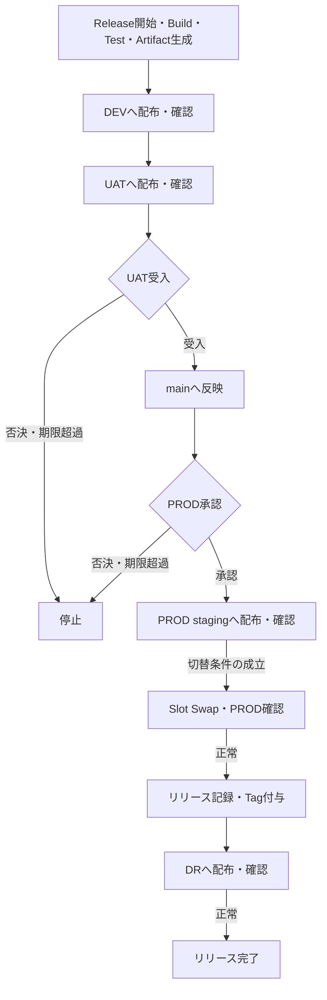

# CI/CD方式設計書（初稿）

本書は、アプリケーションの変更を検証し、各環境へ配布するCI/CD方式を定める。判断が必要な項目は末尾の「要確認」にまとめ、本文中の参照番号と対応付ける。

## 1. CI/CD方式概要

### 1.1 適用範囲・基本方針

Azure Reposでソースコードを管理し、Azure Pipelinesで検証・リリース・復旧を実行する。インフラ構築パイプラインは本書の対象外とする。

| 項目 | 方式 |
|---|---|
| 対象 | アプリケーションのBuild・Test・デプロイ、および配布済みアプリケーションの復旧を対象とする。対象アプリケーションと配布単位は確認01による。 |
| 実行基盤 | Build・Test・Azureへのデプロイ等はSelf-hosted Agentで実行する。 |
| 成果物の利用 | リリース用Artifact（ビルド成果物）はRelease時に一度生成し、DEV → UAT → PROD → DRへ順次配布する。環境ごとの再Buildは行わない。 |
| 配布の制御 | 各環境の確認結果と所定の承認に基づき、次の環境への配布を制御する。 |

### 1.2 環境の役割

| 環境 | 役割 |
|---|---|
| DEV | リリース候補の基本動作を確認する。 |
| UAT | 業務上の受入確認を行う。 |
| PROD | 承認されたリリース版を利用者へ提供する。 |
| DR | 災害対策環境のアプリケーションを、PRODに適用した版に合わせる。 |

### 1.3 CI/CD全体構成図

図は処理と成果物の関係を示す。Agentの箱は実行基盤を表し、台数や用途別の分離構成は表していない。

## 2. ソースコード・ブランチ管理方式

### 2.1 管理対象

アプリケーションのソースコード、パイプライン定義、関連スクリプトをAzure Reposで版管理する。変更内容をレビューでき、リリース版から配布元のソースを特定できる状態を維持する。

### 2.2 ブランチの役割

ブランチ構成は以下を初稿案とする。Hotfixの作成元、具体的なマージ方式、命名規則は確認02で確定する。

| ブランチ | 用途 | 作成元 | 主な反映先 |
|---|---|---|---|
| develop | 開発中の変更を集約する。 | ― | release/* |
| release/* | リリース候補を確定し、受入確認に伴う修正を管理する。 | develop | main。候補で行った修正はdevelopへ反映する。 |
| main | 本番反映対象として受け入れたソースを管理する。 | ― | ― |
| hotfix/* | 本番で発生した問題への修正を管理する。 | 確認02で確定する基点版 | main・develop。継続中の候補への反映要否も確認する。 |

### 2.3 ブランチ管理図

Hotfixの基点版は、稼働中のPRODとの関係を確認して決定する（確認02）。

### 2.4 変更・リリース版の管理

| 項目 | 方式 |
|---|---|
| mainへの反映 | PR（Pull Request：プルリクエスト）によるレビューとBuild検証を経て反映し、通常の直接更新を制限する。その他の保護対象ブランチは確認02による。 |
| PRのBuild検証 | Azure Reposのブランチポリシーにより、PRの変更内容を検証する。自動起動の対象は確認03による。 |
| 受入対象との対応 | UATで確認した候補と、mainへ反映する内容の対応を維持する。 |
| リリースTag | 配布元のソースにTagを付与し、リリース版との対応を記録する。既存のリリースTagは書き換えない。 |
| 稼働版の特定 | 現在の稼働版はデプロイ記録で特定する。mainの最新状態や最新Tagだけで判断しない。 |

Tagを付与する時点は5章、Artifactとの対応は4章に定める。

## 3. パイプライン構成

CI・Release・Recoveryの3種類を基本とし、パイプライン定義をソースコードとともに管理する。起動契機は以下を初稿案とし、具体的な対象ブランチを含め確認03で確定する。

| パイプライン | 役割 | 起動契機 | 主な入力・出力 |
|---|---|---|---|
| CI | ソース変更の妥当性を検証する。Azureへの配布は行わない。 | 対象ブランチ更新時、およびPRのBuild検証時に自動起動する。 | 入力：変更対象のソース。出力：Build・Test結果。 |
| Release | リリース候補の成果物を生成し、各環境へ配布する。通常ReleaseとHotfixで共用する。 | 対象のリリース候補を指定して手動起動する。 | 入力：リリース候補のソース。出力：リリース用Artifact、配布・確認結果。 |
| Recovery | 保存済みの成果物を使用して復旧する。RollbackとDR-onlyを選択する。 | 復旧方式と対象Artifactを指定して手動起動する。 | 入力：保持済みArtifactと復旧対象。出力：復旧結果。 |

CIで行う検証用Buildと、Releaseで行う配布用Buildは区別する。CIの成功だけではAzureへのデプロイを開始しない。

## 4. パイプライン処理方式

### 4.1 処理一覧

各処理では対象と実行結果を確認し、異常がある場合は後続処理を停止する。環境間の移行条件は5章、復旧方法は7章に定める。

| 処理 | 対象パイプライン | 処理内容・結果 |
|---|---|---|
| 対象の取得 | CI・Release・Recovery | 実行に必要なソース・定義、または保持済みArtifactを取得し、指定した対象であることを確認する。 |
| Build・Test | CI・Release | 必要な依存関係を取得し、Buildと自動Testを実行する。結果を記録する。 |
| Artifact生成・保管 | Release | 配布可能な成果物を生成し、Azure Pipelinesに保管する。 |
| 配布対象の確認 | Release・Recovery | 配布対象のArtifactと、リリース・復旧の対象版が対応していることを確認する。 |
| デプロイ | Release・Recovery | 指定した環境へArtifactを配布する。必要な切替処理を実行する。 |
| 稼働確認 | Release・Recovery | アプリケーションの応答と適用版を確認し、配布結果を記録する。 |
| 実行結果の記録 | CI・Release・Recovery | 処理結果を保存し、ソース・Artifact・配布先・実行の対応を追跡可能にする。 |

自動Testの対象と、稼働確認の合格条件は確認07で確定する。

### 4.2 Artifact管理

| 項目 | 管理方式 |
|---|---|
| 生成単位 | リリース候補ごとにReleaseで一度生成する。 |
| 配布 | 各環境で同じArtifactを使用し、配布先での再Buildや環境別の成果物への作り替えを行わない。 |
| 識別 | リリース版、配布元ソース、元のパイプライン実行、Artifactを対応付ける。バージョン名だけで同一成果物と判断しない。 |
| 保管先 | Azure PipelinesのArtifact保管機能を使用する。 |
| 保持 | リリース版とRollback対象を識別し、必要なArtifactおよび元の実行記録を保持する。保持期間・世代数・削除責任は確認04による。 |
| 復旧への利用 | 復旧対象の保存済みArtifactを明示的に選択し、再Buildせずに利用する。 |

### 4.3 環境別設定・記録

環境固有の設定値と秘密情報はArtifactから分離し、配布先に応じて適用する。管理先と変更担当は確認05による。

実行結果、UAT確認、PROD承認、各環境の適用版を関連付けて記録する。これにより、どの成果物を確認・承認し、各環境へ適用したかを追跡する。

## 5. リリース・デプロイ方式

### 5.1 リリースフロー

DEV・UATで確認した候補を本番反映対象とし、PROD承認後に切替を行う。PRODの正常確認後にリリースを記録し、DRへの反映まで完了した時点でリリース全体を完了とする。

図中の自動処理が失敗した場合は、後続処理を停止する。PRODへの反映有無に応じた判断は7章による。

### 5.2 環境別の反映方式・移行条件

| 環境 | 反映方式 | 配布・切替の条件 | 完了判定 |
|---|---|---|---|
| DEV | 対象アプリケーションへ配布する。 | Build・Testが正常終了し、配布用Artifactが生成されていること。 | 基本動作と適用版を確認できること。 |
| UAT | 対象アプリケーションへ配布する。 | DEVでの確認が完了していること。 | 稼働確認に加え、対象版の業務上の受入確認が完了すること。 |
| PROD | Deployment Slot（デプロイスロット）のstagingへ配布し、確認後にSlot Swapで本番へ切り替える。 | UAT受入、候補とmainの内容の整合、PROD承認が成立していること。切替直前にstagingの正常性と対象版の妥当性を確認する。 | 切替後のPRODが正常で、対象版の適用を確認できること。 |
| DR | 対象アプリケーションへ配布する。 | PRODの正常確認とリリース記録が完了していること。 | PRODと同じ版の適用と稼働を確認できること。 |

各アプリケーションの配布方法とスロットの適用対象は確認01による。Slot Swapでは環境固有設定の保持・切替を区別し、具体的な対象設定は確認05で確定する。

### 5.3 確認・承認

| 判断点 | 判断する内容 | 否決・期限超過時の扱い |
|---|---|---|
| UAT確認 | 配布した対象版が、業務上の受入条件を満たすかを判断する。 | PRODへの反映へ進めない。 |
| PROD承認 | UAT結果とリリース内容を踏まえ、本番反映を実施してよいかを判断する。 | PRODの配布・切替を開始しない。 |

候補内容が変わった場合は、変更前の確認・承認を流用せず、新しい成果物を対象に確認する。Hotfixの修正を継続中の候補へ反映する場合も、その候補を新たなReleaseとして確認する。

## 6. 実行・アクセス制御方式

### 6.1 Self-hosted Agentの利用

Build・Test・デプロイ・復旧の実処理はSelf-hosted Agentで実行する。UAT確認などの待機はAzure DevOps側で管理し、その間Agentを占有し続けない。

| 項目 | 制御方式 |
|---|---|
| 利用権限 | Agent Poolを利用できるパイプラインと管理者を限定する。 |
| 実行環境 | 対象アプリケーションのBuild・Testと、Azureへの配布に必要なツールを管理する。 |
| 作業領域 | 前回の実行結果が次の処理へ混入しないよう、必要な作業領域を初期化する。 |
| 接続 | Azure DevOps、依存関係の取得先、Azureの管理・配布・稼働確認先への必要な通信を確保する。 |
| 管理 | Agent・OS・利用ツールの更新、および障害時の復旧を担当する管理者を定める。 |

Agent・Pool・ホストの台数、用途別分離、配置、管理担当は確認06で確定する。

### 6.2 Azure認証・接続権限

Service Connectionを介して、WIF（Workload Identity Federation：ワークロードIDフェデレーション）によりAzureへ認証する。Azure接続用の長期シークレットをパイプラインへ埋め込まない。

| 制御対象 | 制御方式 |
|---|---|
| Azureへの操作権限 | Azure RBAC（Role-Based Access Control：ロールベースのアクセス制御）により、配布対象と必要な操作に範囲を限定する。 |
| 環境ごとのアクセス | 接続の対象環境と権限範囲を明確にし、許可した環境にのみ操作できるようにする。 |
| Service Connectionの利用 | 接続を使用するパイプラインを限定する。CIにはAzureへの配布権限を付与しない。 |
| PRODの保護 | PRODへの操作に使用する接続側で承認・利用制限を管理し、YAMLの変更だけで承認を省略できない構成とする。 |
| 定義・設定の変更 | パイプライン定義はレビュー対象とし、接続・承認・排他の設定を変更できる担当を限定する。 |

接続の分割単位、利用するID、具体的な権限範囲は確認09で確定する。

### 6.3 役割と責任

以下は権限を割り当てるための役割区分であり、担当組織・ユーザーを示すものではない。役割の兼務、本人承認、代行者は確認08で確定する。

| 役割 | 主な責任 |
|---|---|
| 開発担当 | ソース変更、PR作成、検証結果の確認を行う。 |
| リリース・復旧担当 | 対象版を選定し、Release・Recoveryを実行して結果を確認する。 |
| UAT確認担当 | 対象版の業務上の受入可否を判断する。 |
| PROD承認担当 | 本番反映の実施可否を判断する。 |
| CI/CD基盤管理担当 | Agent、接続、パイプライン利用権限、承認・排他設定を管理する。 |

### 6.4 排他制御

同じ環境を複数の実行が同時に更新しないよう制御する。Agentの空き待ちとは別に、配布・確認の対象を保護する。

| 保護対象 | 保護する区間 | 競合時の扱い |
|---|---|---|
| DEV | 配布開始から配布後の稼働確認まで。 | 同じ配布先を更新する後続処理を待機させる。 |
| UAT | 配布開始から受入判断の終了まで。 | 確認中の対象版を別の実行で上書きしない。 |
| PROD・DR | ReleaseではPROD stagingへの配布から本番切替、リリース記録、DR反映の終了まで。Recoveryでは復旧処理の開始から終了まで。 | ReleaseとRecoveryで同じ対象を保護し、後続処理を待機させる。 |

待機後に処理を進める場合も、対象版と実際の適用状態を確認する。

## 7. 復旧方式

### 7.1 復旧方式の区分

Recoveryでは4章で保持したArtifactを使用し、復旧結果を記録する。既存のリリースTagは変更せず、新しいリリースTagも発行しない。

| 方式 | 適用する状況 | 対象版 | 反映範囲・方式 |
|---|---|---|---|
| Rollback | 本番へ反映したアプリケーションを、以前の正常版へ戻す場合。 | 保持済みのRollback対象版。 | 対象版をPROD stagingへ配布・確認し、Swap後にPRODを確認する。その後、復旧後のPRODと同じ版をDRへ反映する。 |
| DR-only | PRODの正常な適用版にDRを合わせる場合。 | 現在のPRODに対応する保持済みArtifact。 | DRのみへ再配布する。PRODの配布・Swapは行わない。 |

復旧対象と適用状態を確認できない場合は、自動的に復旧処理を進めない。復旧時の承認は確認08、PRODの状態を取得できない場合の判断方法は確認10で確定する。

### 7.2 失敗時の基本方針

パイプライン全体の成否だけでなく、実際にどの環境まで反映されたかに基づき対応を判断する。

| 状況 | 基本方針 |
|---|---|
| PROD切替前の失敗 | 本番切替を行わず、原因を解消して対象候補を再確認する。 |
| Swap結果が不明、または切替後のPRODが異常 | 実際の適用状態を確認し、Rollbackの要否を判断する。Swapを無条件に再実行しない。 |
| PRODは正常で、リリース記録のみ未完了 | 適用済みの版を確認し、配布処理と分けて不足する記録を補完する。 |
| PRODは正常で、DR反映が未完了 | 正常なPRODを維持し、DR-onlyによる再配布を行う。 |

## 8. 制約・前提事項

| 項目 | 前提・制約 |
|---|---|
| 利用基盤 | 採用するAzure DevOpsの提供形態で、本書の認証・成果物保管・承認方式が利用できることを前提とする。提供形態は確認01による。 |
| デプロイスロット | PRODのスロット適用対象では、採用プランとアプリケーションが必要なスロット操作に対応していることを前提とする。 |
| ネットワーク | Agentから必要な管理・配布・稼働確認先へ到達できることを前提とする。閉域接続を使用する場合は、配布用エンドポイントとstagingを含む接続・名前解決をネットワーク設計で扱う。 |
| アプリケーション設定 | 同一Artifactを各環境で実行できるよう、環境固有値をBuild時に固定しない構成を前提とする。 |
| データ・設定の互換性 | アプリケーションのRollbackだけでは、DBの構造・データ・外部サービスの状態は元に戻らない。復旧先の版が現在のデータ・設定と互換性を持つことを前提とする。 |
| 切替時の処理 | Slot Swapにより、すべての実行中処理の継続が保証されるものではない。継続性が必要な処理はアプリケーション側で扱う。 |
| Agentの停止 | 実行に必要なAgentが利用できない間は、検証・配布・復旧が遅延または停止する。 |
| 災害対策との分担 | DR-onlyはアプリケーションの再配布を対象とし、データ復旧や利用者の接続先切替は災害対策設計で扱う。 |

## 要確認

以下は初稿時点の未確定事項であり、確定後に該当箇所へ反映する。

| 番号 | 項目 | 確認・決定する内容 | 関連章 |
|---|---|---|---|
| 確認01 | 利用基盤・配布対象 | Azure DevOpsの提供形態、対象アプリケーション、個別／一括の配布単位、アプリ別の配布方法、PRODスロットの適用対象を確定する。 | 1・5・8 |
| 確認02 | ブランチ・リリース版管理 | ブランチ構成案、保護対象、マージ方式、Hotfixの基点版、バージョン・Tagの命名規則を確定する。 | 2 |
| 確認03 | 起動契機 | CIを自動起動するブランチ・PRの対象、およびRelease・Recoveryを手動起動する方式の採否と実行可能なブランチを確定する。 | 2・3 |
| 確認04 | Artifactの保持 | リリース版・Rollback候補の保持期間と世代数、削除を判断する担当を確定する。 | 4 |
| 確認05 | 環境別設定 | 設定値・秘密情報の管理先と変更担当、およびSwap時に保持するスロット設定を確定する。 | 4・5 |
| 確認06 | Agent構成・管理 | Build用とデプロイ用のAgent／Pool／ホスト分離の要否、台数、配置、接続経路、更新・復旧の管理担当を確定する。 | 6 |
| 確認07 | Test・稼働確認 | 自動Testの対象、UAT受入条件、配布後の稼働・適用版確認の方法と合格条件を確定する。 | 4・5 |
| 確認08 | 実行・承認体制 | 各役割の担当、兼務・本人承認・代行の扱い、承認待機期限、Rollback／DR-only時の承認条件を確定する。 | 5・6・7 |
| 確認09 | 接続・権限 | Service Connectionの分割単位と利用するID、Azure側の権限範囲、Azure DevOps側の接続利用・設定変更権限を確定する。 | 6 |
| 確認10 | 状態確認不能時の復旧 | PRODの状態を取得できない場合に復旧対象を判断する根拠と、障害復旧・災害対策設計との責任分担を確定する。 | 7・8 |
