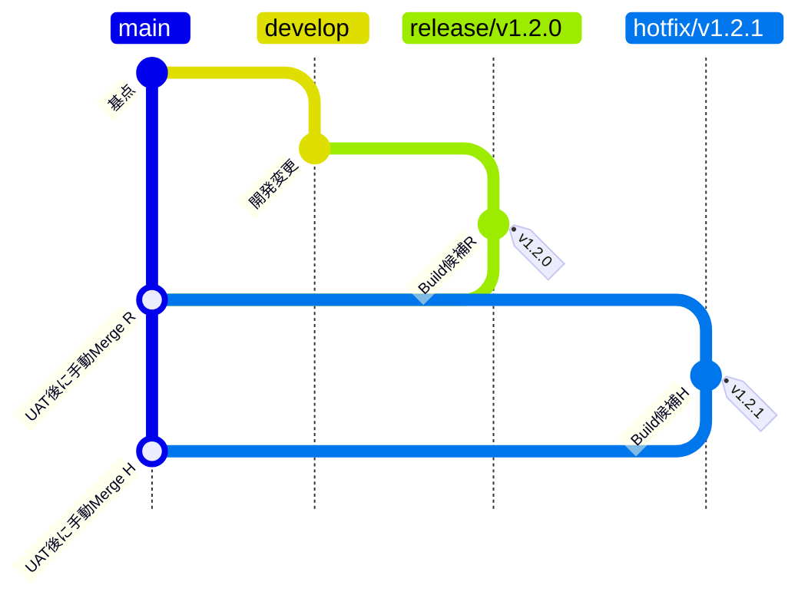
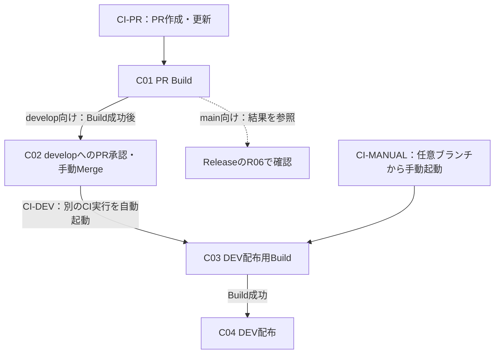
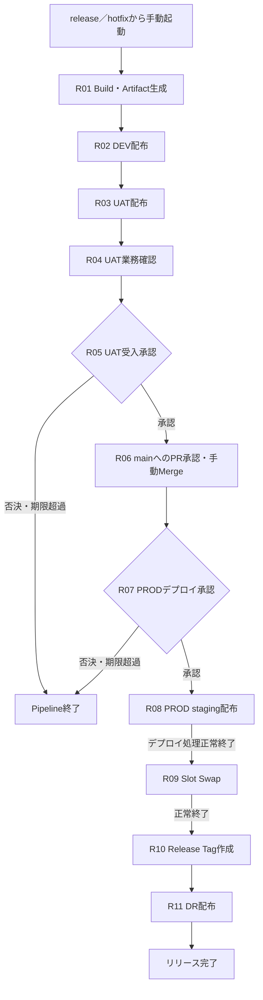
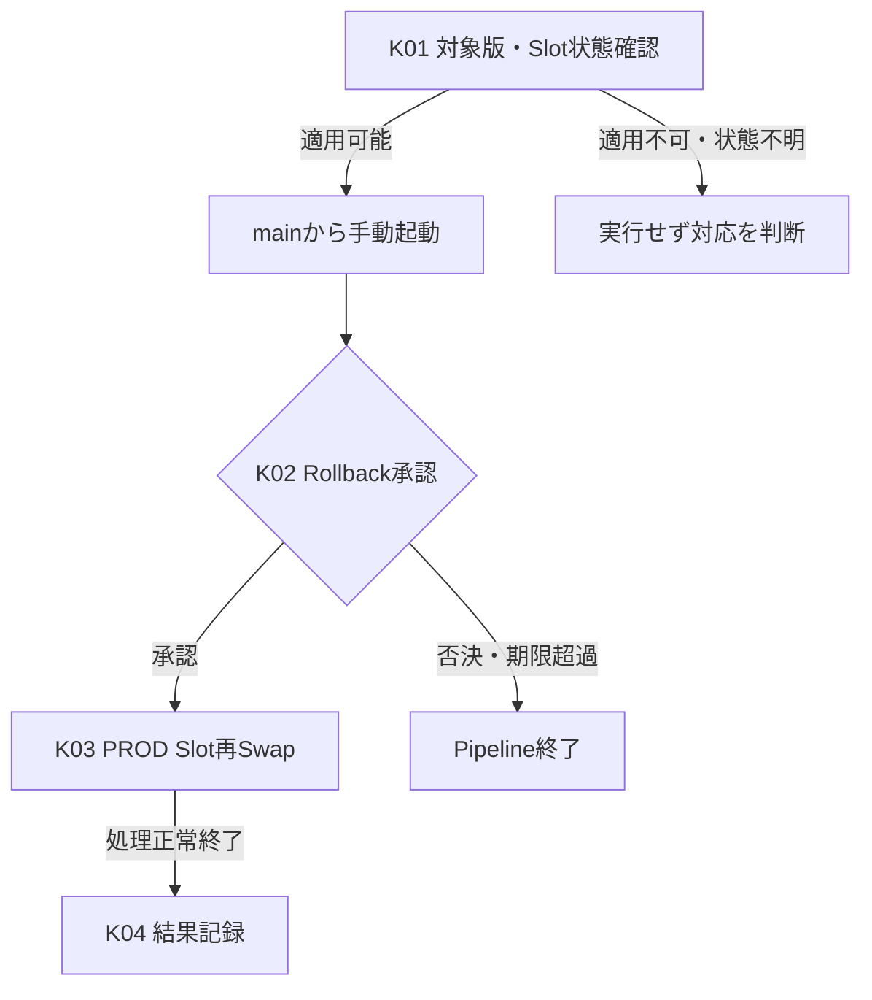

# アプリケーションCI/CD方式設計書

本書は、Azure DevOps Servicesを用いたアプリケーションのBuild、配布および版戻しの方式を定める。Excelでは1～4章をそれぞれ1シートとし、各フロー図と処理・承認表を同じシートに配置する。

| シート | 記載内容 |
|---|---|
| 1. 全体構成・共通方式 | 構成要素、Pipelineとフローの一覧、実行基盤、認証、成果物・設定の管理。 |
| 2. ソース管理・CI | ブランチ管理、PR検証、developへのMergeとDEV配布、手動DEV配布。 |
| 3. Release | DEVからDRまでの配布、UAT受入、mainへのMerge、本番承認、途中失敗時の扱い。 |
| 4. Recovery | PRODの直前版へのRollback、承認、適用条件および責任範囲。 |

図と表のC01／R01／K01等は、処理を対応付けるための資料内の番号とする。

## 1. 全体構成・共通方式

### 1.1 対象・全体構成

Azure Reposでソースを管理し、Azure PipelinesでCI／Release／Recoveryを実行する。対象はDEV／UAT／PROD／DRのアプリケーションCI/CDとし、インフラ構築Pipelineは対象外とする。

図の矢印は制御・成果物・配布順序の関係を表す。詳細な通信経路はネットワーク設計で扱う。

アイコンはMicrosoft公式の[Azure Architecture Icons](https://learn.microsoft.com/azure/architecture/icons/)および[Azure DevOps製品アイコン](https://learn.microsoft.com/azure/devops/)を使用する。

### 1.2 Pipeline・フロー一覧

Pipelineは3種類とし、CIは起動契機に応じて3つのフローを持つ。

| Pipeline | フロー | 起動契機・対象 | 処理の概要 | 対応する図・表 |
|---|---|---|---|---|
| CI | CI-PR：PR検証 | develop／main向けPRの作成・更新。 | Buildのみ。 | 2.3・C01 |
| CI | CI-DEV：開発変更のDEV反映 | developへのMerge。 | Build → DEV配布。 | 2.3・C03～C04 |
| CI | CI-MANUAL：手動DEV反映 | 任意ブランチから手動実行。 | Build → DEV配布。 | 2.3・C03～C04 |
| Release | REL：通常リリース・Hotfix | release／hotfixから手動実行。 | Build・Artifact生成 → DEV → UAT → PROD → DR。 | 3.2・R01～R11 |
| Recovery | REC：直前版Rollback | mainから手動実行。 | 対象確認・承認 → PROD Slot再Swap。 | 4.2・K01～K04 |

| 環境 | 用途 |
|---|---|
| DEV | 開発変更・リリース候補の確認。CIとReleaseの配布先。 |
| UAT | リリース候補の手動業務確認と受入判断。 |
| PROD | 承認されたリリース版の業務利用。 |
| DR | PROD反映後に同じアプリケーション版を配布する災害対策環境。 |

### 1.3 Self-hosted Agent

Build、AzureへのデプロイおよびSlot操作はSelf-hosted Agentで実行する。Build用とDeploy用でAgentを分離せず、東西Agentの相互代替は行わない。

| 配置 | 台数・Pool | 担当処理 |
|---|---|---|
| 東日本 | VM 1台、東日本用Agent Pool。 | Build、DEV／UAT／PROD配布、PRODのSlot Swap・再Swap。 |
| 西日本 | VM 1台、西日本用Agent Pool。 | DR配布。 |

| 項目 | 方式・前提 |
|---|---|
| 接続 | 各AgentからPrivate Endpoint経由でアプリケーションをデプロイする。配布先とPROD stagingを含む到達性・名前解決を確保する。 |
| その他の通信 | Azure DevOps、依存関係取得先、WIF認証先およびAzure管理APIへの必要な通信はネットワーク設計で扱う。 |
| 管理 | Agent VMのOS、Agent、必要ツールの更新・障害復旧はCI/CD基盤管理側で一元管理する。 |
| 停止時 | 対象Agentが利用できない間は、そのAgentの担当処理を実行できない。 |

### 1.4 認証・利用権限

環境ごとにService Connectionを分け、Workload Identity Federation（WIF）でAzureへ認証する。IaC用の接続とは分離し、対象環境へのデプロイ・Slot操作に必要な最小権限を付与する。

| Service Connectionの対象 | 個別認可するPipeline |
|---|---|
| DEV | CI、Release。 |
| UAT | Release。 |
| PROD | Release、Recovery。 |
| DR | Release。 |

| 制御対象 | 方式 |
|---|---|
| 接続の利用・管理 | 全Pipelineへの一括利用許可を無効とし、必要なPipelineのみ個別認可する。接続の作成、WIF設定、権限変更はCI/CD基盤管理者に限定する。 |
| Agent Pool・保護設定 | Poolの利用を必要なPipelineに限定する。Pool・Agent、実行権限・承認・排他設定の管理はCI/CD基盤管理者に限定する。 |
| Tag作成権限 | Releaseが使用するBuild Service Identityに、対象Azure ReposでTagを作成するための必要な権限だけ追加する。専用IDは設けない。 |

各Pipelineの実行者と、Repos／Pipelinesでの承認者は、2～4章の対象フローに記載する。

### 1.5 Pipeline Artifact・環境別設定

| 対象 | 管理方式 |
|---|---|
| 使用する成果物機能 | Azure PipelinesのPipeline Artifactを使用する。Azure Artifactsは使用しない。 |
| 生成・配布 | Release Runで一度生成し、4環境へ同じArtifactを配布する。環境ごとの再Build・作り替えは行わない。 |
| 追跡・保持 | 候補Commit SHA、Release版、元のRelease Run、Artifact、各環境のデプロイ記録を対応付ける。保持はAzure PipelinesのRun／Artifact保持設定に従い、独自の長期保持・世代管理ルールは設けない。 |
| Application Settings | App Service／Functions等の設定反映主体はIaC／Bicepに一元化する。アプリケーションCI/CDから設定を書き換えず、二重管理しない。 |
| 設定値の受け渡し | 必要に応じてAzure DevOps Variable Groupの値をIaC Pipelineへ渡す。 |
| 秘密情報 | Azure Key Vaultで管理し、アプリケーションはApplication SettingsのKey Vault参照を使用する。 |

同一Artifactを各環境で利用できるよう、環境固有値をBuild時に固定しない構成とする。

### 1.6 共通の実行ルール

| 項目 | 方式 |
|---|---|
| 自動確認の範囲 | 自動テスト、Smoke Test、HTTP疎通確認等は実施しない。Pipelineが確認する範囲はBuild・Deploy・Slot Swap等の処理の正常終了までとし、業務動作の正常を保証しない。 |
| 確認・記録 | 対象ソース、Pipeline実行、処理結果、承認結果、配布先を追跡可能にする。業務上の受入はReleaseのUATで手動確認する。 |
| Pipeline上の承認待機 | UAT受入・PRODデプロイ・Rollback承認が否決または期限超過となった場合、Pipelineを終了する。待機期間は詳細設計で定め、待機中はAgentを占有し続けない。 |
| 排他制御 | 同じ対象を複数の実行が同時に更新しないよう制御する。Agentの空き待ちだけに依存せず、保護する区間を各フローで定める。 |
| 基盤の前提 | Azureリソース、Slot、接続経路等は別途構築済みであることを前提とする。 |

## 2. ソース管理・CI

### 2.1 ブランチ管理

アプリケーションのソースコード、Pipeline YAMLおよび関連スクリプトをAzure Reposで管理する。

| ブランチ | 作成元 | 役割 |
|---|---|---|
| `develop` | ― | 開発変更の集約先。通常リリースの作成元。 |
| `release/vX.Y.Z` | `develop` | 通常リリースの候補とRelease実行元。 |
| `main` | ― | UATを完了し、本番反映対象として受け入れたソースの管理。 |
| `hotfix/vX.Y.Z` | `main` | 本番の修正候補とRelease実行元。 |

| 管理項目 | 方式 |
|---|---|
| ブランチ保護 | main／developにBranch Policyを設定し、PRレビューとBuild検証を経て変更を取り込む。Pipeline定義もレビュー対象とする。 |
| Merge方式 | PRはMerge commitで取り込む。 |
| main向けPRテンプレート | UAT完了、対象Release Run、Merge commitの使用、Merge後のPROD承認等を確認するチェックリストを用意する。具体的な項目は詳細設計で定める。 |
| Release Tag | 命名は`vX.Y.Z`とする。付与対象・作成時点はReleaseのR10に定め、既存Tagは付け替えない。 |
| 稼働版の特定 | Release Run、候補Commit、Tagおよびデプロイ記録の対応から特定する。mainの最新Commitだけで稼働版を判断しない。 |

### 2.2 ブランチ管理図

版番号は命名規則を示す例とする。通常リリースとHotfixの候補作成元、およびUAT完了後のmainへのMergeを示す。

図のTag位置は付与先を表し、作成時刻を表すものではない。TagはPRODのSlot Swap正常終了後に、ReleaseがBuildした候補Commitへ自動付与し、mainのMerge Commitには付与しない。

### 2.3 CI・開発変更の反映フロー

| 項目 | 実行条件 |
|---|---|
| CI-PR | develop／main向けPRの作成・更新時に自動起動する。 |
| CI-DEV | developへのMerge後に自動起動する。 |
| CI-MANUAL | 手動実行権限を持つ利用者が、任意ブランチを指定して起動する。 |
| mainへのMerge | Mergeを契機とするDEVデプロイは行わない。 |

C01でPR検証のCI実行は終了する。C02はRepos上の人による操作であり、そのMergeを契機に別のCI実行でC03～C04を行う。

| No. | 処理 | 区分・操作場所 | 実行主体／承認者 | 完了条件・次へ進む条件 |
|---|---|---|---|---|
| C01 | PR Build | 自動・Pipelines | CI Pipeline | PRの変更内容のBuildが正常終了すること。配布は行わない。 |
| C02 | developへのPR承認・手動Merge | マージ承認・手動操作／Repos | 承認：アプリ開発責任者。Merge：人が実施。 | C01の成功とPRレビューを確認して承認し、Merge commitで取り込むこと。 |
| C03 | DEV配布用Build | 自動・Pipelines | CI Pipeline | CI-DEVはMerge後のdevelop、CI-MANUALは指定ブランチをBuildし、正常終了すること。 |
| C04 | DEV配布 | 自動・Pipelines | CI Pipeline | C03の成果物をDEVへ配布し、デプロイ処理が正常終了すること。 |

Build失敗時は配布へ進めず、PRが承認されない場合はMergeしない。CIとReleaseのDEV配布を競合させず、C04の実行中は同じ配布先への後続デプロイを待機させる。

## 3. Release

### 3.1 実行条件

| 項目 | 方式 |
|---|---|
| フロー | REL：通常リリース・Hotfixで共用する。 |
| 起動対象 | `release/vX.Y.Z`／`hotfix/vX.Y.Z`から手動実行する。 |
| 実行者 | アプリ開発担当者、アプリ開発責任者。 |
| 配布対象 | Releaseで生成した同一Pipeline ArtifactをDEV → UAT → PROD → DRへ配布する。CIの成果物は昇格させない。 |
| 完了 | PRODの切替、Tag付与、DR配布まで正常終了した時点で、リリース全体を完了とする。 |

### 3.2 フロー図・処理／承認表

| No. | 処理 | 区分・操作場所 | 実行主体／承認者 | 完了条件・次へ進む条件 |
|---|---|---|---|---|
| R01 | Build・Artifact生成 | 自動・Pipelines | Release Pipeline | 候補Commit SHAを特定して一度だけBuildし、当該RunのPipeline Artifactを生成・登録すること。 |
| R02 | DEV配布 | 自動・Pipelines | Release Pipeline | R01のArtifactをDEVへ配布し、処理が正常終了すること。 |
| R03 | UAT配布 | 自動・Pipelines | Release Pipeline | R02完了後、同じArtifactをUATへ配布し、処理が正常終了すること。 |
| R04 | UAT業務確認 | 手動・UAT | 業務確認担当者 | 対象Release Runの候補について、業務上の受入可否を判断するための確認を完了すること。 |
| R05 | UAT受入承認 | 受入承認・Pipelines | アプリ開発責任者 | R04の結果を受け入れ、対象Releaseの継続を承認すること。 |
| R06 | mainへのPR承認・手動Merge | マージ承認・手動操作／Repos | 承認：アプリ開発責任者。Merge：人が実施。 | UAT済み候補とPRの内容・対象Release Runの対応、C01のPR Build成功を確認し、Merge commitでmainへ取り込むこと。 |
| R07 | PRODデプロイ承認 | デプロイ承認・Pipelines | 運用責任者。自己承認可。 | R05の受入とR06のMerge完了を確認し、本番への配布・切替を承認すること。 |
| R08 | PROD staging配布 | 自動・Pipelines | Release Pipeline | UATで受け入れた同じArtifactをstagingへ配布し、処理が正常終了すること。 |
| R09 | Slot Swap | 自動・Pipelines | Release Pipeline | R08の正常終了後、stagingとproductionをSwapし、処理が正常終了すること。 |
| R10 | Release Tag作成 | 自動・Pipelines | Release Pipeline | R09完了後、R01でBuildした候補Commit SHAへ`vX.Y.Z`を付与すること。mainのMerge Commitには付与しない。 |
| R11 | DR配布 | 自動・Pipelines | Release Pipeline | PROD反映・Tag付与後、同じArtifactをDRへ配布し、処理が正常終了すること。 |

R06のPRではCIのC01によるBuild検証を行うが、ReleaseのArtifactは再生成・差し替えしない。Reposのマージ承認とPipelinesのUAT受入・PRODデプロイ承認は独立した判断とし、相互に代替しない。

自動処理の失敗時は後続を停止する。表の正常終了は処理の完了を指し、アプリケーションの業務動作確認を意味しない。

### 3.3 配布方式・排他制御

| 対象 | 方式・制約 |
|---|---|
| DEV／UAT／DR | Slotを使用せず、対象アプリケーションへ配布する。 |
| PROD | Slot対応のサービス・プランを使用する。Slotの主目的は本番切替と直前版へのRollbackを容易にすることとし、stagingでの業務接続確認・Smoke Testは行わない。 |
| PRODの設定 | production／stagingは原則同じApplication Settingsを使用し、固定が必要な設定のみDeployment slot settingとする。設定の反映は1.5のIaC／Bicepで行う。 |
| Slot上のアプリケーション | stagingも稼働するため、ジョブ・外部連携の重複実行への対応、およびSwapに伴う実行中処理の継続性はアプリケーション設計で扱う。 |
| DEVの排他 | R02の配布中は、CIを含め同じ配布先を更新する後続処理を待機させる。 |
| UATの排他 | R03の配布開始からR05の受入判断終了まで、別のReleaseによる候補の上書きを防ぐ。 |
| PROD・DRの排他 | R08の開始からR11の終了まで、別のReleaseおよびRecoveryと更新を競合させない。 |

### 3.4 候補変更・途中失敗時の扱い

| 状況 | 対応方針 |
|---|---|
| 候補Commitの変更 | 新しいRelease RunでR01から実行する。変更前の確認・承認を流用せず、UAT受入をやり直す。 |
| 未完了Release中のHotfix | 既存Releaseを中止し、mainからHotfixを作成する。新しい候補としてRELを実行し、UAT受入をやり直す。 |
| PROD切替前の失敗 | 後続を停止し、失敗原因と候補を確認する。 |
| Slot Swapの成功／失敗が不明 | 自動再実行・自動再Swapを行わない。運用担当者がAzure上の実状態を確認してから対応を判断する。 |
| PROD更新後に業務上の問題が判明 | 4章の適用条件を確認し、承認を得てRecoveryによるRollbackを行う。 |
| PRODは正常に更新済みで、Tag付与等の後続処理が失敗 | 正常なPRODはRollbackせず、未完了の処理だけを補完する。 |
| DRデプロイのみ失敗 | 同じRelease Runの同じPipeline ArtifactでDR Stage（R11）だけを再実行する。PRODのデプロイ・Swapは再実行しない。 |

DR Stageの再実行は、当該Run・Artifactが利用でき、現在のPRODと同じ版を配布する場合に行う。他のRelease・Recoveryと更新を競合させず、Recovery Pipelineは後続処理の補完に使用しない。

## 4. Recovery

### 4.1 実行条件・責任範囲

| 項目 | 方式 |
|---|---|
| フロー | REC：PRODの直前版へのRollbackのみを対象とする。 |
| 起動対象・実行者 | 運用担当者または運用責任者が、mainから手動実行する。 |
| 対象版 | 直前のSlot Swapでstagingへ移った、productionの直前1世代。 |
| 復旧方式 | production／stagingを再Swapする。Buildおよび過去Artifactの取得・再配布は行わない。 |
| 責任範囲 | アプリケーションの版戻しまでとする。DB／データ・Azureリソース・外部システムの復旧、DR切替、DNS／Front Door切替は別の障害復旧・DR設計で扱う。 |

### 4.2 フロー図・処理／承認表

| No. | 処理 | 区分・操作場所 | 実行主体／承認者 | 完了条件・次へ進む条件 |
|---|---|---|---|---|
| K01 | 対象版・Slot状態確認 | 手動・Azure実状態／実行記録 | 運用担当者・運用責任者 | stagingに直前版が残り、対象版とSlotの状態、現在のデータ・設定との互換性を確認できること。 |
| K02 | Rollback承認 | 復旧承認・Pipelines | 運用責任者。自己承認可。 | K01の確認結果を踏まえ、PRODを直前版へ戻すことを承認すること。 |
| K03 | PROD Slot再Swap | 自動・Pipelines | Recovery Pipeline | production／stagingの再Swap処理が正常終了すること。 |
| K04 | 結果記録 | 自動・Pipelines | Recovery Pipeline | 対象版、承認、再Swapの実行結果を記録すること。 |

### 4.3 制約・失敗時の扱い

| 項目 | 制約・対応方針 |
|---|---|
| 復旧可能な範囲 | 次のReleaseでstagingを上書きした場合など、直前版がSlotに残っていない場合は本方式で戻せない。 |
| データ・設定 | 再SwapではDB・データやIaC管理の設定を過去の状態へ復旧しない。直前版と現在のデータ・設定との互換性を前提とする。 |
| DR・Tag | PRODのみを戻し、DRの版は変更しない。Release Tagの新規作成・付け替えも行わない。 |
| 排他 | K03の再Swapを、ReleaseのPROD・DR更新、DR Stageの再実行、別のRecoveryと同時に実行しない。 |
| 再Swap結果が不明 | 自動再実行・自動再Swapは行わず、運用担当者がAzure上の実状態を確認してから対応を判断する。 |
| DR設計との分担 | DRへのアプリケーション配布は災害時の業務切替完了を意味しない。責任範囲外の復旧・切替は別の障害復旧・DR設計に従う。 |
