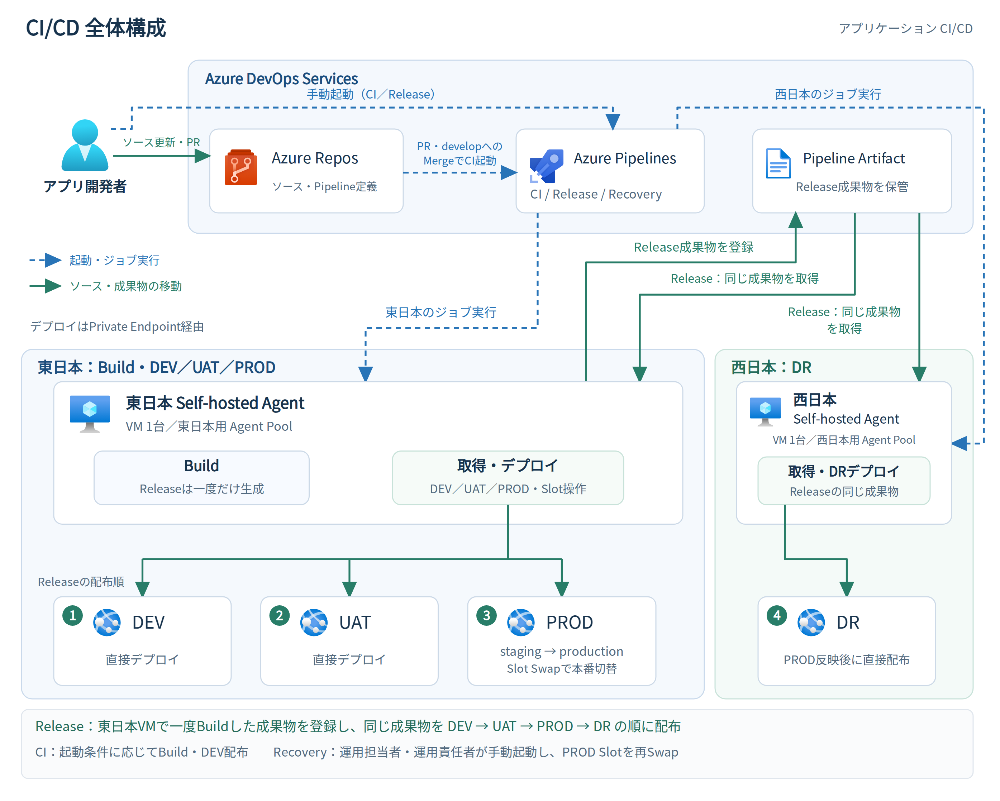
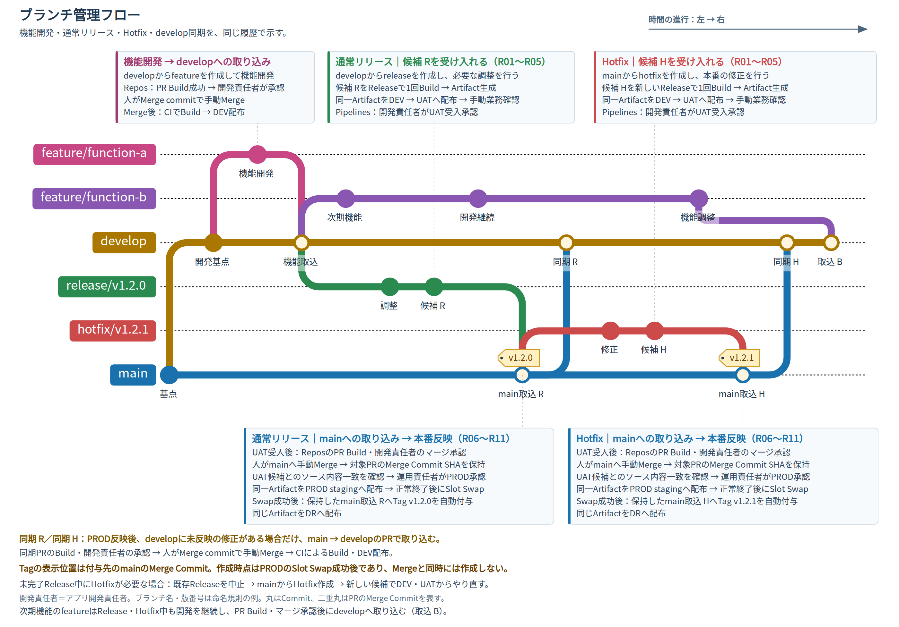
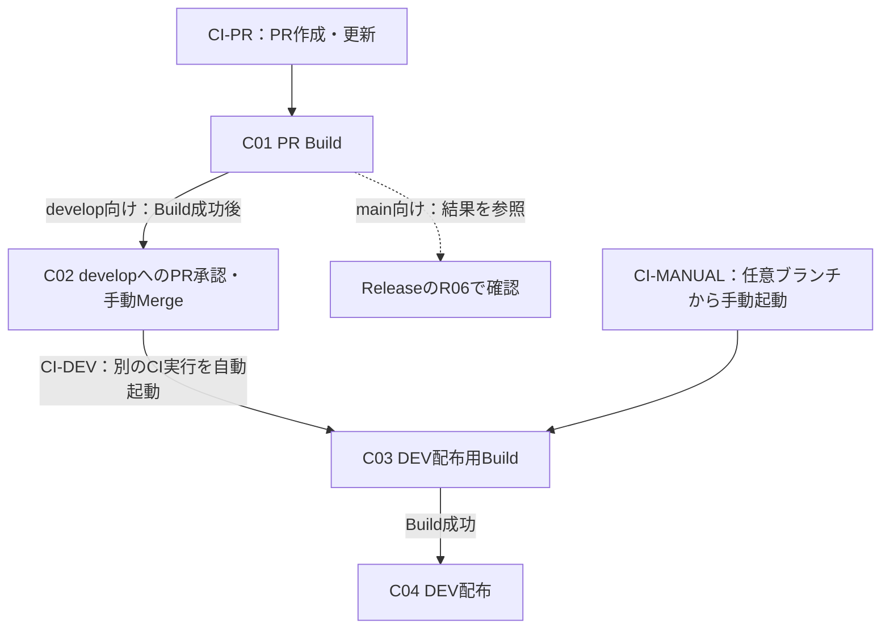
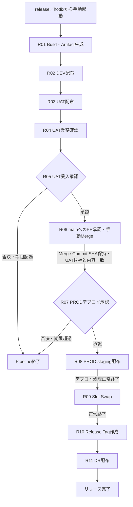
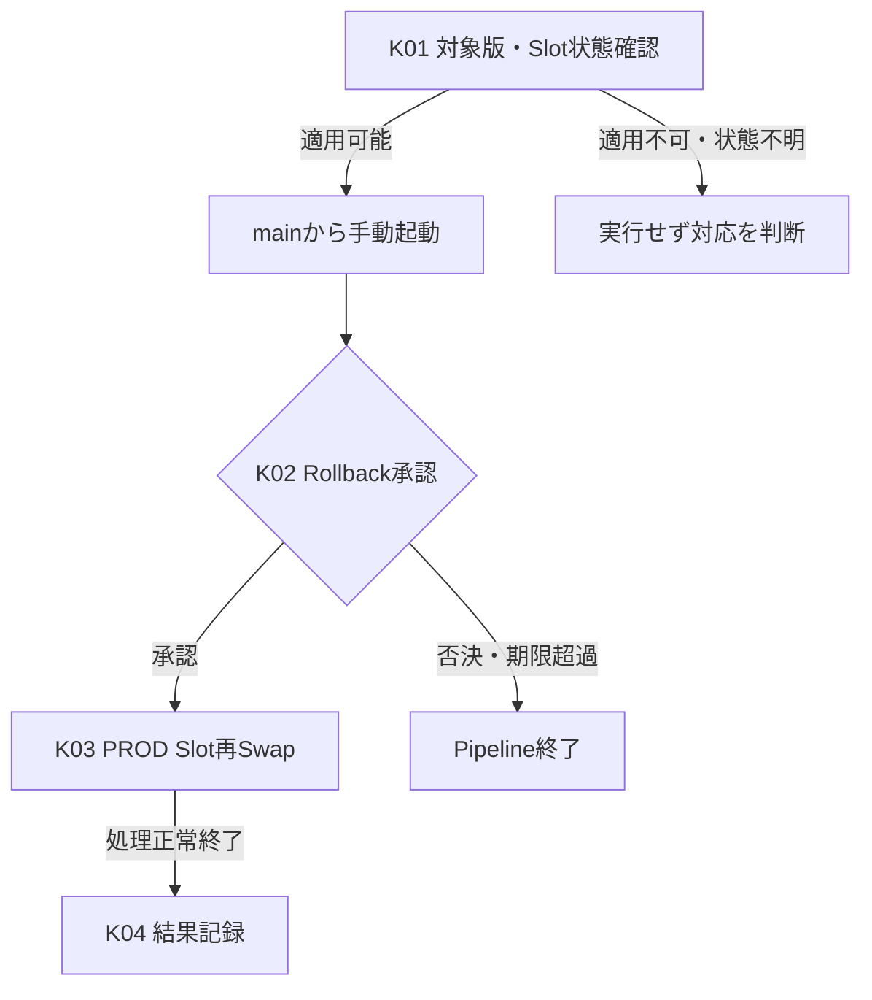

# アプリケーションCI/CD方式設計書

## 1. 全体構成・共通方式

### 1.1 対象・全体構成

Azure DevOps Servicesを利用し、Azure Reposでソースを管理、Azure PipelinesでBuild・配布・版戻しを実行する。対象はDEV／UAT／PROD／DRのアプリケーションCI/CDとし、インフラ構築Pipelineは対象外とする。

### 1.2 Pipeline・フロー一覧

PipelineはCI／Release／Recoveryの3種類とする。CIは起動契機に応じてPR検証、自動DEV反映、手動DEV反映を行う。

| Pipeline | フロー | 起動契機・対象 | 処理の概要 | 詳細 |
|---|---|---|---|---|
| CI | CI-PR：PR検証 | develop／main向けPRの作成・更新。 | Buildのみ。 | 2.4・C01 |
| CI | CI-DEV：開発変更のDEV反映 | developへのMerge。 | Build → DEV配布。 | 2.4・C03～C04 |
| CI | CI-MANUAL：手動DEV反映 | 任意ブランチから手動実行。 | Build → DEV配布。 | 2.4・C03～C04 |
| Release | REL：通常リリース・Hotfix | release／hotfixから手動実行。 | Build・Artifact生成 → DEV → UAT → PROD → DR。 | 3.2・R01～R11 |
| Recovery | REC：直前版Rollback | mainから手動実行。 | 対象確認・承認 → PROD Slot再Swap。 | 4.2・K01～K04 |

| 環境 | 用途 |
|---|---|
| DEV | 開発変更・リリース候補の確認。CIとReleaseの配布先。 |
| UAT | リリース候補の手動業務確認と受入判断。 |
| PROD | 承認されたリリース版の業務利用。 |
| DR | PROD反映後に同じアプリケーション版を配布する災害対策環境。 |

### 1.3 Self-hosted Agent

Build、AzureへのデプロイおよびSlot操作は、次のSelf-hosted Agentで実行する。

| 配置 | 台数・Pool | 担当処理 |
|---|---|---|
| 東日本 | VM 1台、東日本用Agent Pool。 | Build、DEV／UAT／PROD配布、PRODのSlot Swap・再Swap。 |
| 西日本 | VM 1台、西日本用Agent Pool。 | DR配布。 |

アプリケーションのデプロイは各AgentからPrivate Endpoint経由で行う。配布先とPROD stagingへの到達性・名前解決、およびAzure DevOps、依存関係取得先、WIF認証先、Azure管理APIへの通信を確保する。

Agent VMのOS、Agent、必要ツールの更新・障害復旧はCI/CD基盤管理側で一元管理する。東西Agentの相互代替は行わず、停止中はそのAgentの担当処理を実行できない。

### 1.4 認証・利用権限

Azureへの認証にはWorkload Identity Federation（WIF）を使用する。環境ごとにService Connectionを分け、デプロイ・Slot操作に必要な最小権限を付与し、IaC用の接続とは分離する。

| Service Connectionの対象 | 個別認可するPipeline |
|---|---|
| DEV | CI、Release。 |
| UAT | Release。 |
| PROD | Release、Recovery。 |
| DR | Release。 |

Service ConnectionとAgent Poolは必要なPipelineに個別認可する。Service Connectionの全Pipelineへの一括利用許可を無効とし、接続の作成・WIF設定・権限変更、Agent基盤、実行権限・承認・排他設定の管理はCI/CD基盤管理者に限定する。

Releaseが使用するBuild Service Identityには、対象Azure ReposでTagを作成するために必要な最小限の権限を付与する。

### 1.5 Pipeline Artifactの管理

Releaseで一度生成したPipeline Artifactを、DEV → UAT → PROD → DRへ順次配布する。同一Artifactを各環境で使用できるよう、環境固有値はBuild時に固定せず、配布先の設定で扱う。

Build元の候補Commit SHA、mainへの取込結果であるMerge Commit SHA、Release版、元のRelease Run、Artifact、各環境のデプロイ記録を対応付ける。保持はAzure PipelinesのRun／Artifact保持設定に従う。

### 1.6 環境別設定・秘密情報

App Service／Functions等のApplication Settingsは、IaC／Bicepを唯一の設定反映主体とする。必要に応じてAzure DevOps Variable Groupの値をIaC Pipelineへ渡す。

秘密情報はAzure Key Vaultで管理し、アプリケーションはApplication SettingsのKey Vault参照を使用する。

### 1.7 確認・承認・排他の基本方針

Pipelineが自動で確認する範囲はBuild・Deploy・Slot Swap等の処理の正常終了までとし、自動テスト・Smoke Test・HTTP疎通確認は実施しない。Pipeline成功は業務動作の正常を保証せず、業務上の受入可否はUATでの手動確認により判断する。処理結果・承認結果を実行記録と対応付ける。

Pipelines上のUAT受入・PRODデプロイ・Rollback承認が否決または期限超過となった場合、Pipelineを終了する。待機期間は詳細設計で定め、待機中はAgentを占有し続けない。

同じ配布先を複数の実行が同時に更新しないよう、対象フローの区間ごとに排他制御を行う。Azureリソース、Slot、接続経路等は別途構築済みであることを前提とする。

## 2. ソース管理・CI

### 2.1 ブランチ管理

アプリケーションのソースコード、Pipeline YAMLおよび関連スクリプトをAzure Reposで管理する。

| ブランチ | 作成元 | 役割 |
|---|---|---|
| `feature/<機能名>` | `develop` | 機能単位の開発。完了した変更をPRでdevelopへ取り込む。 |
| `develop` | ― | 開発変更の集約先。通常リリースの作成元。 |
| `release/vX.Y.Z` | `develop` | 通常リリースの候補とRelease実行元。 |
| `hotfix/vX.Y.Z` | `main` | 本番の修正候補とRelease実行元。 |
| `main` | ― | UATを完了し、本番反映対象として受け入れたソースの管理。 |

main／developにはBranch Policyを設定し、PRレビューとBuild検証を経て、Merge commitで変更を取り込む。Pipeline定義もレビュー対象とする。

main向けPRには、UAT完了、対象Release Run、Merge commitの使用、Merge後のPROD承認等を確認するチェックリストを用意する。具体的な項目は詳細設計で定める。

Release Tagは`vX.Y.Z`とし、本番に反映したリリースのmainへのMerge Commitを識別する。Release Runとの対応からBuild元と配布記録を追跡し、既存Tagは付け替えない。

### 2.2 ブランチ管理図

機能開発・通常リリースからHotfixまでの履歴を、左から右へ進む1枚の図で示す。ブランチは上からfeature、develop、release、hotfix、mainの順とし、図中のブランチ名・版番号は命名規則の例とする。

[拡大表示（SVG）](images/branch-flow.svg)

図中の候補 R／候補 Hは、Releaseが実際にBuildするCommitを表す。Tagの表示位置は付与先のmainへのMerge Commitを示し、実際の作成時点はPRODのSlot Swap正常終了後とする。Releaseが、対象PRのMerge完了後に保持したMerge Commit SHAへ自動付与する。

通常リリースの図は、release上での調整がdevelopに未反映の例とする。PROD反映後のmain → develop同期は、2.3の条件に従う。

### 2.3 developへの同期

PROD反映後、リリース時の調整またはHotfix修正がdevelopに未反映の場合、main → developのPRで取り込む。通常リリースで追加修正がなく、変更が既にdevelopに含まれている場合は、同期PRを作成しない。

アプリ開発担当者またはアプリ開発責任者がPRを作成し、アプリ開発責任者の承認後、Merge commitで手動Mergeする。同期PRにもC01のBuild検証を適用し、developへのMerge後はC03～C04によるBuild・DEV配布を実行する。

### 2.4 CI・開発変更の反映フロー

feature → developのPRではC01のBuild検証後、アプリ開発責任者の承認を受け、Merge commitで手動Mergeする。developへのMerge後はC03～C04によりBuild・DEV配布を自動実行する。

main向けPRおよびmain → developの同期PRもC01の対象とする。任意ブランチ（featureを含む）からは、手動実行権限を持つ利用者の起動によりBuild・DEV配布を行う。mainへのMergeを契機とするDEV配布は行わない。

PR検証はC01で完了し、developへのMerge後は別のCI実行でC03～C04を行う。

| No. | 処理 | 実行・承認 | 完了・移行条件 |
|---|---|---|---|
| C01 | PR Build | 自動 | develop／main向けPRの変更内容のBuild成功。 |
| C02 | developへのPR承認・手動Merge | Repos：アプリ開発責任者が承認、人が手動Merge。 | C01の成功とPRレビューを確認し、Merge commitで取り込む。 |
| C03 | DEV配布用Build | 自動 | CI-DEVはMerge後のdevelop、CI-MANUALは指定ブランチのBuild成功。 |
| C04 | DEV配布 | 自動 | C03の成果物をDEVへ配布し、正常終了。 |

Build失敗時は配布へ進めず、PRが承認されない場合はMergeしない。C04の実行中は、Releaseを含め同じDEV配布先への後続デプロイを待機させる。

## 3. Release

### 3.1 起動・配布方針

アプリ開発担当者またはアプリ開発責任者が、`release/vX.Y.Z`／`hotfix/vX.Y.Z`から手動で起動する。通常リリースとHotfixを共通のフローで扱う。

一度生成したArtifactを4環境へ配布し、PRODの切替、Tag付与、DR配布まで正常終了した時点でリリースを完了とする。

### 3.2 フロー図・処理／承認表

| No. | 処理 | 実行・承認 | 完了・移行条件 |
|---|---|---|---|
| R01 | Build・Artifact生成 | 自動 | 候補Commit SHAから一度だけBuildし、当該RunのArtifactを登録。 |
| R02 | DEV配布 | 自動 | R01のArtifactをDEVへ配布し、正常終了。 |
| R03 | UAT配布 | 自動 | R02完了後、同じArtifactをUATへ配布し、正常終了。 |
| R04 | UAT業務確認 | UAT：担当者が手動確認。 | 対象候補の業務上の受入可否を判断できること。 |
| R05 | UAT受入承認 | Pipelines：アプリ開発責任者。 | R04の結果から業務上の受入条件を満たすことを確認し、継続を承認。 |
| R06 | mainへのPR承認・手動Merge | Repos：アプリ開発責任者が承認、人が手動Merge。 | release／hotfixとUAT済み候補・Runの対応、C01の成功を確認し、Merge commitでmainへ取り込む。対象PRのMerge完了後、ReleaseがそのMerge Commit SHAを当該Runに保持する。 |
| R07 | PRODデプロイ承認 | Pipelines：運用責任者。自己承認可。 | UAT受入、mainへのMergeとSHA保持の完了、および取込結果とUAT済み候補のソース内容の一致を確認し、本番反映を承認。 |
| R08 | PROD staging配布 | 自動 | UATで受け入れた同じArtifactをstagingへ配布し、正常終了。 |
| R09 | Slot Swap | 自動 | R08の正常終了後、staging／productionをSwapし、正常終了。 |
| R10 | Release Tag作成 | 自動 | R09の正常終了後、R06で保持したmainのMerge Commit SHAへ`vX.Y.Z`を付与。 |
| R11 | DR配布 | 自動 | PROD反映・Tag付与後、同じArtifactをDRへ配布し、正常終了。 |

R06のCIはPR検証用とし、各環境への配布には引き続きR01のArtifactを使用する。mainへのMerge後にRelease用の再Buildは行わず、Tag作成時も最新のmain HEADではなく、保持したMerge Commit SHAを使用する。自動処理の失敗時は後続を停止する。

### 3.3 デプロイ・排他制御

DEV／UAT／DRは対象アプリケーションへ直接配布し、PRODのみDeployment Slotを使用する。Slotの主目的は本番切替と直前版へのRollbackを容易にすることとし、stagingへのデプロイ処理の正常終了を条件にSwapする。

production／stagingは原則同じApplication Settingsを使用し、Slotごとに固定が必要な設定のみDeployment slot settingとする。設定の反映はIaC／Bicepで行う。

stagingも稼働するため、ジョブ・外部連携の重複実行や、Swapに伴う実行中処理の継続性はアプリケーション設計で扱う。PRODのサービス・プランは必要なSlot操作に対応することを前提とする。

| 保護対象 | 保護区間・競合時の扱い |
|---|---|
| DEV | R02の配布中は、CIを含め同じ配布先への後続デプロイを待機させる。 |
| UAT | R03の開始からR05の受入判断終了まで、別のReleaseによる候補の上書きを防ぐ。 |
| PROD・DR | R08の開始からR11の終了まで、別のReleaseおよびRecoveryと更新を競合させない。 |

### 3.4 候補変更・途中失敗時の扱い

候補Commitを変更した場合は、新しいRelease RunでR01から実行し、UAT受入をやり直す。未完了Release中にHotfixが必要となった場合は、既存Releaseを中止し、mainから作成したHotfixを新しい候補として同じフローで確認する。

| 状況 | 対応方針 |
|---|---|
| mainへの取込結果とUAT済み候補のソース内容が異なる | PRODへ進めず、変更を候補へ反映し、新しいRelease RunでUAT受入をやり直す。 |
| PROD切替前の失敗 | 後続を停止し、失敗原因と候補を確認する。 |
| Slot Swapの成功／失敗が不明 | 自動再実行・自動再Swapは行わず、運用担当者がAzure上の実状態を確認して判断する。 |
| PROD更新後に業務上の問題が判明 | Recoveryの適用条件を確認し、承認を得てRollbackする。 |
| PRODは正常に更新済みで、Tag付与が失敗 | 正常なPRODを維持し、保持した同じMerge Commit SHAを使用して未完了のTag処理を補完する。 |
| DRデプロイのみ失敗 | 同じRelease Runの同じArtifactでDR Stage（R11）だけを再実行する。 |

DR Stageの再実行は、当該Run・Artifactが利用でき、現在のPRODと同じ版を配布する場合に行う。他のRelease・Recoveryと更新を競合させない。

## 4. Recovery

### 4.1 起動・復旧方針

運用担当者または運用責任者が、mainから手動で起動する。PRODのproduction／stagingを再Swapし、stagingに残る直前1世代へ戻す。

対象はアプリケーションの版戻しとし、BuildやArtifactの再配布は行わない。DB／データ・Azureリソース・外部システムの復旧、DR切替、DNS／Front Door切替は別の障害復旧・DR設計で扱う。

### 4.2 フロー図・処理／承認表

| No. | 処理 | 実行・承認 | 完了・移行条件 |
|---|---|---|---|
| K01 | 対象版・Slot状態確認 | 運用担当者・運用責任者が手動確認。 | stagingに直前版が残り、Slotの実状態と現在のデータ・設定との互換性を確認できること。 |
| K02 | Rollback承認 | Pipelines：運用責任者。自己承認可。 | K01の確認結果を踏まえ、PRODの直前版への復帰を承認。 |
| K03 | PROD Slot再Swap | 自動 | production／stagingの再Swap処理が正常終了。 |
| K04 | 結果記録 | 自動 | 対象版・承認・再Swapの実行結果を記録。 |

### 4.3 適用条件・制約

次のReleaseでstagingを上書きした場合など、直前版がSlotに残っていない場合は本方式で戻せない。再SwapではDB・データやIaC管理の設定は復旧しないため、直前版と現在のデータ・設定との互換性を前提とする。

K03はReleaseのPROD・DR更新、DR Stageの再実行、別のRecoveryと排他制御する。承認・排他の待機後もK01の適用条件を確認する。再Swapの結果が不明な場合は自動再実行せず、運用担当者による実状態確認後に対応を判断する。

Rollbackの反映範囲はPRODとし、DRの版とRelease Tagは維持する。災害時の業務切替は別のDR設計に従う。
