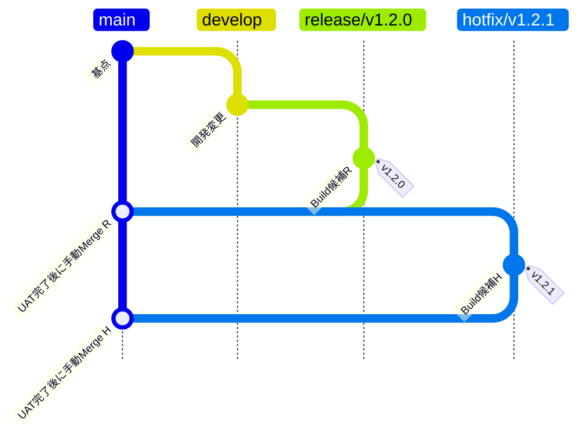
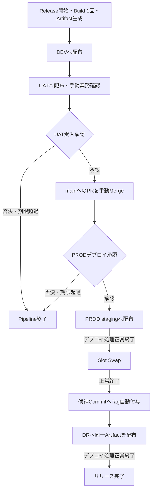

# アプリケーションCI/CD方式設計書

本書は、Azure DevOps Servicesを用いたアプリケーションのBuild、配布および版戻しの方式を定める。インフラ構築Pipelineは対象外とし、アプリケーションCI/CDとの責任分担のみを記載する。

## 1. CI/CD方式概要

### 1.1 適用範囲・基本方針

| 項目 | 採用方式 |
|---|---|
| ソースコード管理 | Azure Reposを使用する。 |
| CI/CD | Azure PipelinesでCI／Release／Recoveryの3種類のPipelineを実行する。 |
| 実行基盤 | BuildおよびAzureへのデプロイ・Slot操作はSelf-hosted Agentで実行する。配置と役割は6章に定める。 |
| 成果物の配布 | Releaseで一度生成したPipeline ArtifactをDEV → UAT → PROD → DRへ順次配布する。環境ごとの再Buildは行わない。 |
| 品質確認 | Pipelineは処理の正常終了を確認する。業務上の受入可否はUATでの手動確認と承認により判断する。 |
| 復旧 | PRODの直前版へのRollbackを対象とする。方式と責任範囲は7章に定める。 |

### 1.2 環境の役割

| 環境 | 役割 |
|---|---|
| DEV | 開発中の変更やリリース候補を配布し、開発担当者が確認する環境。 |
| UAT | リリース候補の業務上の受入確認を行う環境。 |
| PROD | 承認されたリリース版を利用者へ提供する環境。 |
| DR | PRODへの反映後に、同じアプリケーション版を配布する災害対策環境。 |

### 1.3 CI/CD全体構成図

図は制御、成果物および配布先の関係を示す。矢印は論理的な処理の関係であり、詳細な通信経路を示すものではない。

構成図のアイコンは、Microsoft公式の[Azure Architecture Icons](https://learn.microsoft.com/azure/architecture/icons/)および[Azure DevOps製品アイコン](https://learn.microsoft.com/azure/devops/)を使用する。

## 2. ソースコード・ブランチ管理方式

### 2.1 管理対象・ブランチの役割

アプリケーションのソースコード、Pipeline YAMLおよび関連スクリプトをAzure Reposで版管理する。

| ブランチ | 作成元 | 用途 |
|---|---|---|
| `develop` | ― | 開発中の変更を集約する。通常リリースの作成元とする。 |
| `release/vX.Y.Z` | `develop` | 通常リリースの候補を管理し、Release Pipelineの実行元とする。 |
| `main` | ― | UATを完了し、本番反映対象として受け入れたソースを管理する。 |
| `hotfix/vX.Y.Z` | `main` | 本番の修正候補を管理し、Release Pipelineの実行元とする。 |

### 2.2 ブランチ管理図

図の版番号は命名規則を示す例であり、通常リリースと、その後のHotfixを表す。

Tagの表示位置は付与先のCommitを示し、Tagを作成する時刻を示すものではない。実際にはmainへのMergeとPROD承認を経て、PRODのSlot Swapが正常終了した後にRelease PipelineがTagを自動作成する。

### 2.3 変更・リリース版の管理

| 項目 | 管理方式 |
|---|---|
| ブランチ保護 | `main`／`develop`にBranch Policyを設定し、PRレビューとBuild検証を経て変更を取り込む。 |
| PRのMerge方式 | Merge commitを使用する。 |
| mainへの反映 | UAT完了後、`release/vX.Y.Z`または`hotfix/vX.Y.Z`からmainへのPRを人が手動でMergeする。 |
| PRテンプレート | main向けPRには、UAT完了、対象Release Run、Merge commitの使用、Merge後のPROD承認等を確認するチェックリストを用意する。具体的な項目は詳細設計で定める。 |
| 候補の整合 | mainへ取り込む内容とUAT済み候補の整合をPRで確認する。候補Commitを変更した場合は、新しいRelease RunでBuildと受入確認をやり直す。 |
| Release Tag | `vX.Y.Z`とし、Release Pipelineが実際にBuildした候補Commit SHAへ付与する。mainのMerge Commitには付与しない。既存Tagは付け替えない。 |
| 稼働版の特定 | Release Run、候補Commit、Tagおよびデプロイ記録の対応から特定する。mainの最新Commitだけで稼働版を判断しない。 |
| 未完了Release中のHotfix | 既存Releaseを中止し、mainを起点にHotfixを作成する。新しい候補として通常のRelease経路を通し、UAT受入をやり直す。 |

## 3. パイプライン構成

3種類のPipelineの役割と起動対象を以下に定める。処理内容は4章、環境間の移行条件は5章、実行権限は6章に定める。

| Pipeline | 役割 | 起動契機・対象 | 主な出力 |
|---|---|---|---|
| CI | 変更のBuild検証と、開発用のDEV配布。 | develop／main向けPRの作成・更新時に自動起動する。developへのMerge後にも自動起動する。任意ブランチから手動実行できる。 | Build結果、対象実行のDEVデプロイ結果。 |
| Release | リリース用成果物の生成と、4環境への順次配布。通常リリースとHotfixで共用する。 | `release/vX.Y.Z`／`hotfix/vX.Y.Z`から手動実行する。 | Pipeline Artifact、リリース・承認・デプロイ記録、Release Tag。 |
| Recovery | PRODの直前版へのRollback。 | `main`から手動実行する。 | PROD Slotの再Swap結果、承認・復旧記録。 |

CIのBuild成果物をリリース用成果物として昇格させず、Releaseが配布用のPipeline Artifactを生成する。

## 4. パイプライン処理方式

### 4.1 CIの処理

| 起動条件 | 処理 |
|---|---|
| develop／main向けPRの作成・更新 | PRの変更内容をBuildする。DEVへのデプロイは行わない。 |
| developへのMerge後 | Merge後のソースをBuildし、DEVへ自動デプロイする。 |
| 任意ブランチからの手動実行 | 指定ブランチのソースをBuildし、DEVへデプロイする。 |
| mainへのMerge後 | Mergeを契機とするDEVデプロイは行わない。本番反映は実行中のReleaseで継続する。 |

### 4.2 共通処理・Release・Recoveryの処理

| 処理 | 対象Pipeline | 処理内容 |
|---|---|---|
| ソース・定義の取得 | CI／Release／Recovery | 実行対象のソースまたはPipeline定義を取得する。ReleaseではBuild対象の候補Commitを特定する。 |
| Build | CI／Release | 必要な依存関係を取得してBuildする。Releaseでは候補Commitから一度だけBuildする。 |
| Pipeline Artifactの生成・登録 | Release | Build成果物を配布可能な単位にまとめ、当該Release Runに登録する。 |
| デプロイ | CI／Release | CIは4.1の条件に従ってDEVへ配布する。Releaseは同一Artifactを各環境へ配布する。 |
| 本番切替 | Release | PROD stagingへデプロイし、その処理の正常終了後にproductionとのSlot Swapを実行する。 |
| Tag作成 | Release | PROD Slot Swapの正常終了後、Buildした候補CommitへRelease Tagを自動付与する。 |
| 版戻し | Recovery | BuildおよびArtifactの配布を行わず、PROD Slotを再Swapする。適用条件は7章に定める。 |
| 結果の記録 | CI／Release／Recovery | 対象ソース、実行結果、承認結果およびデプロイ先を記録する。ReleaseではArtifactとの対応も記録する。 |

異常終了した処理から後続へは進めず、対応は7章に従う。自動テスト、Smoke Test、HTTP疎通確認等の自動稼働確認は実施せず、Pipelineによる確認はBuild・Deploy・Slot Swap等の処理の正常終了までとする。

### 4.3 Pipeline Artifactの管理

| 項目 | 管理方式 |
|---|---|
| 使用機能 | Azure PipelinesのPipeline Artifactを使用する。Azure Artifactsは使用しない。 |
| 生成・配布単位 | 1つのRelease Runで一度生成し、DEV／UAT／PROD／DRで同じArtifactを使用する。 |
| 環境差分 | 環境別の再BuildやArtifactの作り替えは行わない。環境固有の値は4.4の設定で扱う。 |
| 追跡 | 候補Commit SHA、Release版、元のRelease Run、Pipeline Artifactおよび各環境のデプロイ記録を対応付ける。 |
| 保持 | Azure PipelinesのRun／Artifact保持設定に従う。本方式固有の長期保持・世代管理ルールは設けない。 |
| 復旧との関係 | Recoveryでは過去のArtifactを使用しない。 |

### 4.4 環境別設定・秘密情報

Application SettingsはIaC／Bicepを唯一の設定反映主体とし、アプリケーションCI/CD Pipelineからは書き換えない。

| 対象 | 管理・反映方式 |
|---|---|
| Application Settings | Azure App Service／Functions等の環境別設定をIaC／Bicepで反映する。同じ設定をCI/CDからも更新する二重管理は行わない。 |
| 設定値の受け渡し | 必要に応じ、Azure DevOps Variable Groupの値をIaC Pipelineへ渡す。IaC Pipeline自体の方式は本書の対象外とする。 |
| 秘密情報 | Azure Key Vaultで管理する。アプリケーションからはApplication SettingsのKey Vault参照を使用する。 |
| PRODのSlot設定 | production／stagingは原則同じApplication Settingsを使用する。Slotごとに固定する必要がある設定のみDeployment slot settingとする。 |

## 5. リリース・デプロイ方式

### 5.1 リリースフロー

UAT受入後に人がmainへPRをMergeし、その後にPRODデプロイ承認を行う。PROD反映後のTag作成とDRへの配布まで正常終了した時点で、リリース全体を完了とする。

自動処理の失敗時は後続を停止する。図の「正常終了」は処理の完了を指し、アプリケーションの業務動作確認を意味しない。

### 5.2 環境別の反映方式・移行条件

| 環境 | 反映方式 | 開始条件 | 次の処理へ進む条件 |
|---|---|---|---|
| DEV | Slotを使用せず対象アプリケーションへ配布する。 | ReleaseのBuildとPipeline Artifactの生成が正常終了していること。 | DEVデプロイ処理が正常終了していること。 |
| UAT | Slotを使用せず対象アプリケーションへ配布する。 | DEVデプロイ処理が正常終了していること。 | UATデプロイ処理と手動業務確認が完了し、UAT受入承認を得ていること。 |
| PROD | stagingへ配布し、デプロイ処理の正常終了後にSlot Swapする。 | UAT受入承認、release／hotfixからmainへの手動PR Merge、PRODデプロイ承認が順に完了していること。 | Slot Swapが正常終了し、候補CommitへのTag付与が完了していること。 |
| DR | Slotを使用せず、PRODと同一Artifactを配布する。 | PRODへの反映とTag付与が完了していること。 | DRデプロイ処理が正常終了していること。 |

本表はReleaseの移行条件を示す。CIによるDEV配布は4.1に従う。

### 5.3 UAT受入・本番移行の判断

| 判断点 | 判断内容 |
|---|---|
| UAT受入 | 担当者によるUATでの手動業務確認を完了し、対象Release Runの候補を受け入れてPipelineを継続する。 |
| mainへのPR Merge | Repos上で候補の取り込みを判断する。PRのマージ承認は、Pipeline上のUAT受入承認やPRODデプロイ承認を代替しない。 |
| PRODデプロイ | UAT受入と対象候補のmainへのMerge完了を確認し、本番への配布・切替を許可する。 |

Pipeline上の承認が否決された場合、または所定期間内に行われない場合はPipelineを終了する。承認の具体的な待機期間は詳細設計で定め、承認者と自己承認の扱いは6章に定める。

### 5.4 PROD Deployment Slotの利用方針

Slotの主目的は本番切替と直前版へのRollbackを容易にすることとする。stagingでは業務接続確認やSmoke Testを行わず、デプロイ処理の正常終了を条件にSlot Swapへ進む。

Slot Swap後のstagingには直前のproductionの版が残る。Rollbackでの利用条件は7章に定める。

## 6. 実行・アクセス制御方式

### 6.1 Self-hosted Agentの配置・管理

| 配置 | 台数・Pool | 担当処理 |
|---|---|---|
| 東日本 | Self-hosted Agent VM 1台、東日本用Agent Pool。 | Build、DEV／UAT／PRODへのデプロイ、PRODのSlot SwapおよびRecoveryの再Swap。 |
| 西日本 | Self-hosted Agent VM 1台、西日本用Agent Pool。 | DRへのデプロイ。 |

| 項目 | 利用・管理方式 |
|---|---|
| 用途分離 | Build用とDeploy用でAgentを分離しない。 |
| 相互代替 | 東西Agentの相互代替は行わない。 |
| デプロイ接続 | 各Agentから配布先のPrivate Endpoint経由でアプリケーションをデプロイする。認証・Azure管理操作等の通信要件は8章に定める。 |
| 基盤管理 | Agent VMのOS、Agent、必要ツールの更新および障害復旧はCI/CD基盤管理側で一元管理する。 |
| 利用制御 | Agent Poolを利用できるPipelineと、Pool・Agentを管理できる担当を限定する。 |

### 6.2 Service Connection・Azure認証

環境ごとにService Connectionを分け、Workload Identity Federation（WIF）でAzureへ認証する。各接続は対象環境のデプロイ・Slot操作に必要な最小権限に限定し、IaC用Service Connectionとは分離する。

| Service Connectionの対象 | 個別認可するPipeline |
|---|---|
| DEV | CI、Release。 |
| UAT | Release。 |
| PROD | Release、Recovery。 |
| DR | Release。 |

| 制御対象 | 制御方式 |
|---|---|
| Pipelineへの認可 | 全Pipelineへの一括利用許可を無効とし、上表の必要なPipelineのみ個別認可する。 |
| 接続管理 | Service Connectionの作成、WIF設定および権限変更はCI/CD基盤管理者に限定する。 |
| Tag作成権限 | Release Pipelineが使用するBuild Service Identityに、対象Azure ReposでTagを作成するために必要な権限だけ追加する。Tag作成専用IDは設けない。 |
| 定義・保護設定 | Pipeline定義はPRレビュー対象とし、実行権限・承認・排他設定の変更権限をCI/CD基盤管理者に限定する。 |

### 6.3 実行・承認の役割

| 操作 | 実行者 |
|---|---|
| Release Pipelineの手動実行 | アプリ開発担当者、アプリ開発責任者。 |
| Recovery Pipelineの手動実行 | 運用担当者、運用責任者。 |

Repos上のマージ承認とPipeline上の承認は、それぞれ独立した判断として管理する。

| 判断対象 | 承認を行う場所 | 承認者 | 承認の役割 |
|---|---|---|---|
| developへのPRマージ承認 | Azure Repos | アプリ開発責任者 | 開発変更の取り込みを許可する。 |
| UAT受入承認 | Azure Pipelines | アプリ開発責任者 | 手動業務確認の結果を受け入れ、Releaseの継続を許可する。 |
| release／hotfix → mainのPRマージ承認 | Azure Repos | アプリ開発責任者 | UAT済み候補のmainへの取り込みを許可する。 |
| PRODデプロイ承認 | Azure Pipelines | 運用責任者 | mainへのMerge後、本番への配布・切替を許可する。 |
| Recovery／Rollback承認 | Azure Pipelines | 運用責任者 | PRODの直前版への版戻しを許可する。 |

PRODデプロイ承認およびRollback承認では自己承認を許容する。承認待機はAzure DevOps側で管理し、待機中はAgentを占有し続けない。

### 6.4 排他制御

同じ配布先を複数の実行が同時に更新しないよう制御する。Agentの実行待ちだけに依存せず、CI／Release／Recovery間で競合する更新とUAT確認中の候補を保護する。

| 保護対象 | 保護する範囲 | 競合時の扱い |
|---|---|---|
| DEV | CIまたはReleaseのデプロイ処理。 | 同じ配布先への後続デプロイを待機させる。 |
| UAT | Releaseの配布開始からUAT受入判断の終了まで。 | 受入確認中の候補を別のReleaseで上書きしない。 |
| PROD・DRへのリリース | PROD stagingへの配布開始からSlot Swap、Tag作成、DR配布の終了まで。 | 別のReleaseやRecoveryによる更新を同時に実行しない。 |
| PRODのRollback | RecoveryのSlot再Swap処理。 | ReleaseのPROD・DR更新および別のRecoveryと同時に実行しない。 |
| DR配布の再実行 | 同じRelease RunのDR Stage。 | 他のRelease・Recoveryと競合させず、対象版と現在のPROD適用版の対応を確認して実施する。 |

## 7. 復旧方式

### 7.1 PROD直前版へのRollback

Recoveryは、PRODのproduction／staging Slotの再Swapによるアプリケーションの版戻しだけを行う。

| 項目 | 方式 |
|---|---|
| 対象版 | 直前のSlot Swapでstagingへ移った、productionの直前1世代。 |
| 適用条件 | stagingにRollback対象の直前版が残っており、対象とSlotの実状態を確認できること。 |
| 実行 | mainから手動実行し、運用責任者のRollback承認後に再Swapする。 |
| 処理範囲 | Build、過去Artifactの取得・再配布およびDRへの配布は行わない。 |
| 完了判定・記録 | 再Swap処理の正常終了を確認し、対象版、承認および実行結果を記録する。Release Tagの新規作成・付け替えは行わない。 |
| 責任範囲 | アプリケーションの版戻しまでとする。DB／データ、Azureリソース、外部システムの復旧、DR切替、DNS／Front Door切替は別の障害復旧・DR設計で扱う。 |

次のReleaseでstagingを上書きした場合など、直前版がSlotに残っていない場合は本方式で戻せない。RollbackはPRODのみを対象とし、DRの版は自動的には変更しない。

### 7.2 処理失敗時の扱い

Pipeline全体の成否だけでなく、実際にどこまで反映されたかに基づいて対応を判断する。

| 状況 | 対応方針 |
|---|---|
| PROD切替前に処理が失敗 | 後続処理を停止し、失敗原因と候補を確認する。候補を変更する場合は新しいRelease Runで受入をやり直す。 |
| Slot Swapの成功／失敗を判定できない | 自動再実行・自動再Swapを行わない。運用担当者がAzure上の実状態を確認してから対応を判断する。 |
| PROD更新後にアプリケーションの問題が判明 | Slotの状態と直前版への復帰可否を確認し、承認を得て7.1のRollbackを行う。 |
| PRODは正常に更新済みで、Tag付与等の後続処理が失敗 | 正常なPRODはRollbackしない。未完了の処理だけを補完する。 |
| DRデプロイのみ失敗 | 同じRelease Runの同じPipeline Artifactを使用し、DR Stageだけを再実行する。PRODのデプロイ・Swapは再実行しない。 |

DR Stageの再実行は当該RunとArtifactが利用でき、現在のPRODと同じ版を配布する場合に行う。Recovery Pipelineは後続処理の補完には使用しない。

## 8. 制約・前提事項

| 項目 | 前提・制約 |
|---|---|
| 利用基盤 | Azure DevOps Servicesを利用する。Azureリソース、Slot、接続経路等は別途構築済みであることを前提とする。 |
| アプリケーション構成 | 環境固有値をBuild時に固定せず、同一Artifactを4環境で使用できることを前提とする。 |
| Slotの適用 | PRODの対象サービス・プランが必要なSlot操作に対応することを前提とする。DEV／UAT／DRではSlotを使用しない。 |
| ネットワーク | 配布先とPROD stagingを含むPrivate Endpointへの到達性・名前解決を確保する。Azure DevOps、依存関係取得先、WIF認証先およびAzure管理APIへの必要な通信はネットワーク設計で扱う。 |
| Agentの停止 | 東日本Agent停止中はBuild・DEV／UAT／PROD配布・Rollbackを、西日本Agent停止中はDR配布を実行できない。相互代替による継続は行わない。 |
| 確認範囲 | Pipeline成功はアプリケーションの業務動作正常を保証しない。UATで担当者が手動業務確認を行う。 |
| Slot上のアプリケーション | stagingも稼働するため、ジョブや外部連携の重複実行等への対応はアプリケーション設計で扱う。 |
| データ・設定との互換性 | Slot再SwapではDB・データやIaC管理の設定を過去の状態へ復旧しない。直前版が現在のデータ・設定と互換性を持つことをRollbackの前提とする。 |
| 切替時の処理 | Slot Swapに伴う実行中処理の継続性はアプリケーション側で扱う。 |
| 障害復旧・DRとの分担 | DRへのアプリケーション配布は災害時の業務切替完了を意味しない。7章の責任範囲外の復旧・切替は別の障害復旧・DR設計に従う。 |
